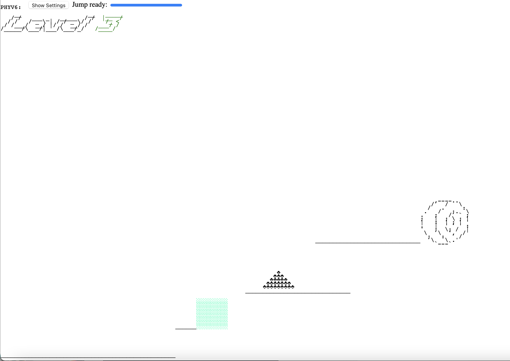

In 2018, I became interested in a challenge: would it be possible to run some kind of browser game on a Kindle eReader?

The main limitation, besides the limited screen space and even more limited browser and refresh rate, is one of support: the kindle doesn't support anything more modern than HTML 4. Therefore, I couldn't use any kind of modern web technology, including the HTML5 `<canvas>` element.

## The Renderer

Therefore, I started by building the basics of the engine, the renderer. In initial versions, this used a simple buffering system that updated the screen every frame, but I later realized that this was too slow and moved to a more advanced version that checked whether the game state changed and only updated the screen when it did.

Everything on the screen was some kind of shape, whether that shape was a simple rectangle or a more complex bitmap (such as a character).

## The Physics

For the physics portion, I also used a relatively simple system that kept track of each shape's velocity and could add to it using physical forces like gravity, drag, or a reaction force to any collision. This worked well enough for simple games, but for later versions a lot of hacks had to be put in place for the collision to work right.

## Platformed

Once the renderer and physics were done, I created a game I christened "Platformed" for its simple nature: jump your way to the portal in each level without hitting any of the obstacles, which would reset the level.

In more advanced versions, I later added color rendering:

which also made their way into the levels:

# Conclusion

Overall, this project was an excellent way to learn more about Javascript and building advanced games with simple hardware! Although I did end up testing it on the kindle, the framerate made it almost impossible to play.
