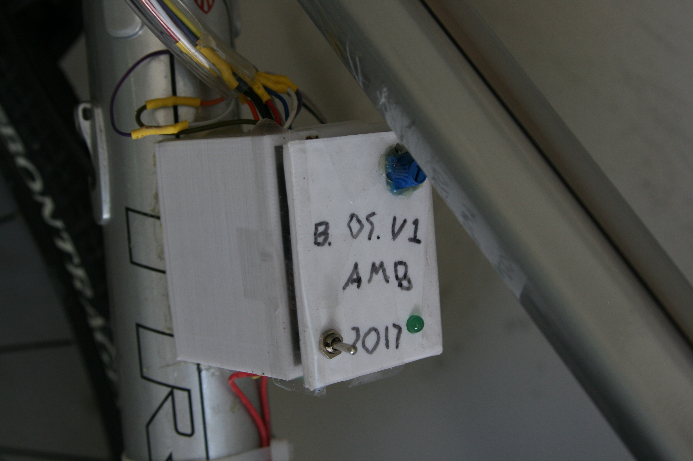

# Bike Computer V1 and V2

One of my first ever projects was a bike computer to track the distace and time it took me to get to my middle school each day.

This portfolio post serves to highlight the journey of creating, testing and deploying my first advanced technical project.

Version 1 of the bike computer was a simple piece of protoboard with an Arduino Nano soldered on along with a few peripherals. Its method for measuring speed and distance were also relatively simple; I had a hall effect sensor on the back tire along with a magnet that passed by once per revolution.
By measuring the time between revolutions, and using a known tire diameter, I could extrapolate the speed of the tire. By adding up that speed over a time, I could make a (good) estimation of the distance travelled. And this system worked, too - I was able to get the same accuracy as a commercial bike meter my dad was using!

By this time, I also had some experience with soldering from previous smaller projects, so I was able to make the connections required on the bottom of the protoboard correctly.

Overall, by the time I was able to deploy it, I had something that looked like this:

Once I was able to complete some basic tests on the ground, I 3D printed a very simple mount using TinkerCAD, and hot glued it onto the bike along with a handle-mounted display and button to control the power state. This led to this picture of V1 deployed on the bike for the first time!

First ride to school while tracking distance and speed:

And longest bike ride I ever undertook while using it, 27.3mi over a weekend trip with my dad:

As helpful as the system was, it definitely had several of its own disadvantages. Firstly, the battery was very difficult to change (buried in the bottom of the box) and it was non-rechargeable, running off of a standard 9V battery. Secondly, the display was always on when the unit was on, and it was only capable of simple MPH or odometer readouts.

This led to the creation of a second version a few months later that would fix all of these problems. I started with a rechargeable battery, larger enclosure, and mode switch to allow changing between several different methods of operation, including an ambient temperature sensor and a lap timer.

The newly redesigned interface features two different LEDs as well as the mode button and potentiometer to adjust display brightness (display was the same as previous version):

Once the new enclosure was tested and new board was assembled, it was tested:

And finally, deployed:

# Conclusion

Overall, this project was a fantastic foray into the world of microcontrollers and 3D design. Between designing for the outdoors (hint: hot glue!) and learning about rechargeable batteries, it set the stage for many future projects. A more advanced version of the design was in fact incorporated into the electric EBike built a few years later.
