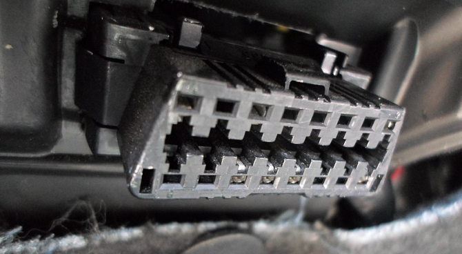
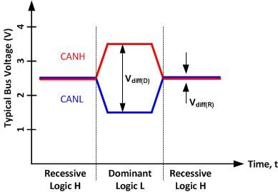
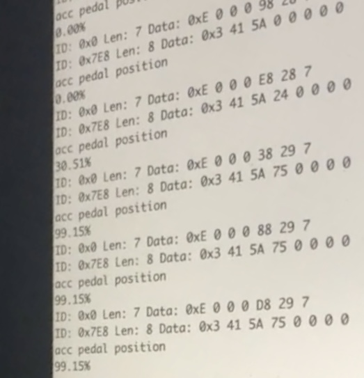

# Car Hacking

During 2019, I decided to try to understand cars better by writing some code to interface with my family's Subaru Forester in real time.

For some background, all modern cars have some form of ECU (Electronic Control Unit), that manages a number of parameters such as fuel pressure, air to fuel ratio, and more. It's tasked with not only keeping the engine and other peripherals running safely in a number of external of conditions, but also keeping it within regulations for fuel efficiency and emissions.

In order to understand the complex series of operations going on inside my car, a 2018 Subaru Forester, I first had to understand the language that my car commmunicates in. Cars nowadays are mandated to have an OBD-II port, that communicates with CAN, LIN, or some other proprietary vehicle protocol (FlexCAN).

Between all these acronyms, once I had physical access to the port and the understanding of the protocol that it communicates with, I next had to figure out what to actually send to the car to make it tell my anything that's even remotely interesting.

The issue with this, is that car manufacturers are not required to disclose the specific commands that they program into their cars, except to dealerships which have access to advanced tools that I don't. So in order to get any data out of the car, I stuck to the standard [OBD-II Parameter ID codes](https://en.wikipedia.org/wiki/OBD-II_PIDs) which are mandated to be supported in every car by the federal government.

In just using these, I wouldn't have access to more advanced features of the car such as triggering the headlights remotely, but I could still read some fairly interesting data. The challenge I set to myself was reading the pressure in the accelerator pedal in real time, as it was a good example of reading critical data that also can be modified easily by simply pressing the pedal to make sure my code was working correctly.

Before I eventually got it working, though, there was a fair bit of reverse engineering I had to do to get it to work at all. Firstly, from the hardware side, CAN is a protocol based on differential signaling, meaning that for every data bit sent, it is reflected on two signals which are inverses of each other. This increases the reliability of the transmission, but does somewhat limit the bitrate and complicate the hardware.

Secondly, after my initial attempts sending OBD PIDs directly failed, after scouring obscure user manuals for tester tools I realized I had to send a repeating "tester present" signal that would put the ECU into a mode to receive further commands. After trying this, I finally had some results that looked pretty good (you can tell I was pretty excited about it)!

Finally, I was able to query the car's ECU for whatever data I wanted. Once again, I chose the accelerator pedal as a fairly simple but useful metric of a successful read. After some more debugging to ensure starting the engine was disabled, I finally got it to work!

Note the percentages in the following screenshot:

All of this was controlled by my code written in C++, which sent the signals to the CAN bus.

# Conclusion

Overall, this was a super cool project that let me learn a ton more about cars, debugging ports in commercial products, the CAN protocol, and the reverse engineering process. Understanding more about computers that are all around us was also fascinating to learn how much we depend on them for something as mundane as driving!