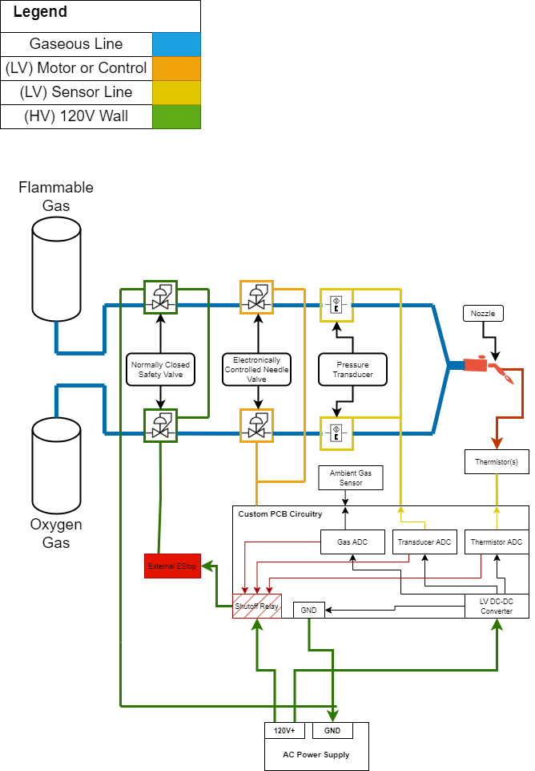
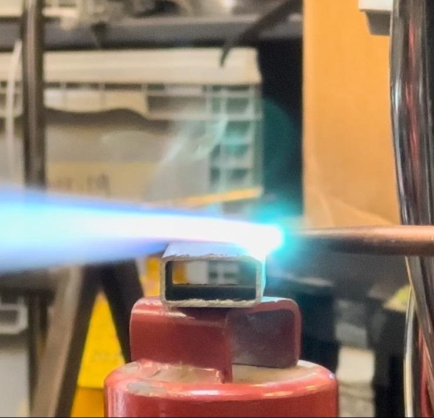
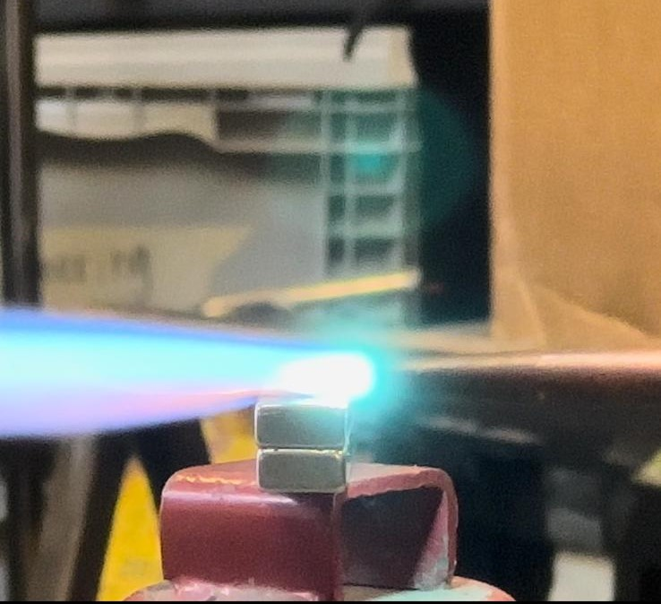
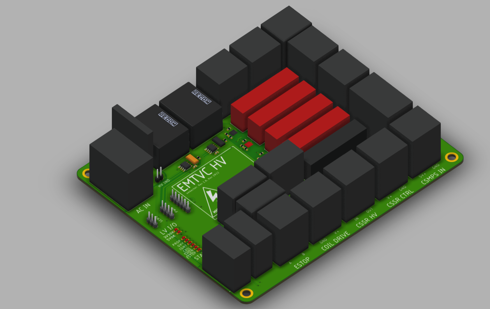
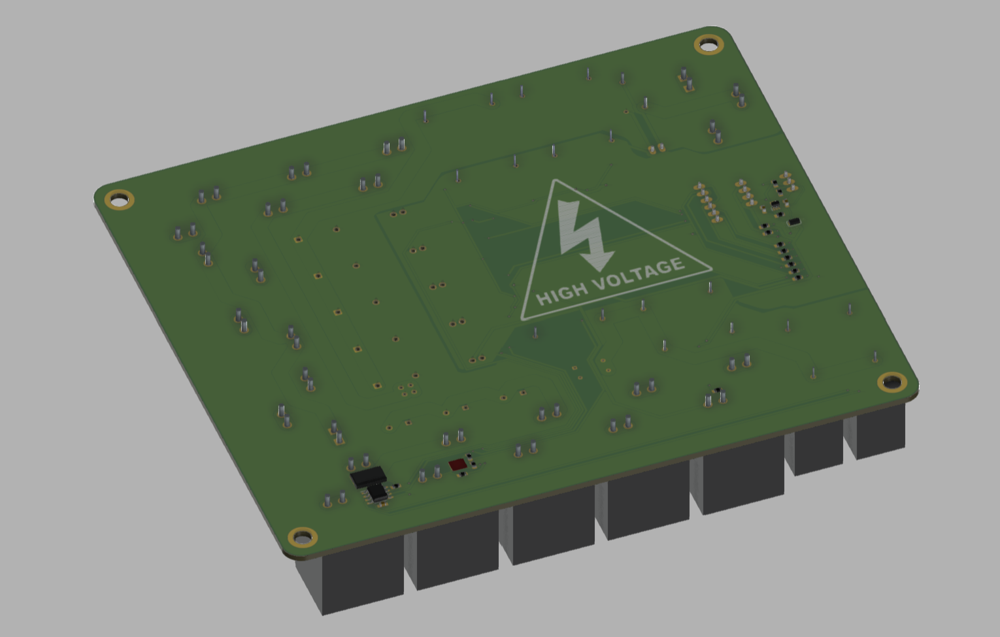

# EMTVC

In Fall/Spring 2022, I have begun to work on an exciting thesis project as part of my graduation requirements at MIT.
This project is currently being sponsored by MIT ProjX and the Department of Mechanical Engineering.
Rocket vehicles require the ability to vary the orientation of their thrust to ensure they follow the desired trajectory. This change in thrust orientation - called thrust vectoring - currently requires heavy, complex, and slow to actuate hardware, decreasing rocket stability and payload to orbit, as well as increasing cost.
A demo of thrust vectoring, from a Lockheed Martin F-22 raptor aircraft can be seen below:

POYNT seeks to change this. An electromagnet array can be integrated into the rocket thrust nozzle, creating a magnetic gradient that will deflect the thrust plume to a new desired vector. This constitutes a solid-state replacement of the moving mechanism, which will be both lighter and more reliable once fully implemented. Furthermore, it will be possible to integrate this magnetic array into existing nozzle designs, allowing POYNT to leverage existing launch providers' rockets and technologies.

So far, we are mostly in a design phase, but we have begun to build a prototype of the engine itself. This prototype will be used to test the feasibility of the design, and to begin to characterize the magnetic field and deflection that will be produced.

As with any project, safety is a major concern, so we started with a safety plan:

We also did some tests of a commercial welding torch and some smaller fixed magnets to see how they would interact.

The very small deflection here is indicative of the strength of the magnetic field required to make a meaningful difference to the thrust plume of a real rocket.

Then, I moved to designing the high-voltage avionics system that controls the electromagnet as well as the flammable gas and oxygen supply system. This system will be powered by a single outlet (AC 120V), and will be controlled by a microcontroller. The microcontroller will be connected to a computer via ethernet, which will be used to control the system. The system will be designed to be as safe as possible, and will be tested extensively before being used on the rocket.

So far, the HV PCB is done and is being tested. Images below:

There's also a schematic:

More updates to come as progress continues!
