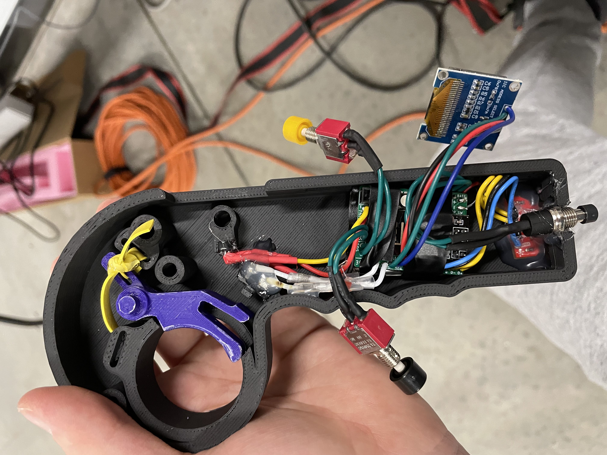
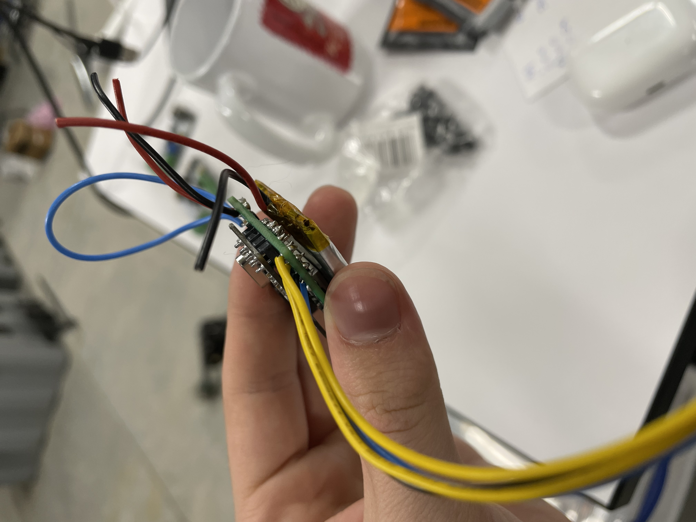
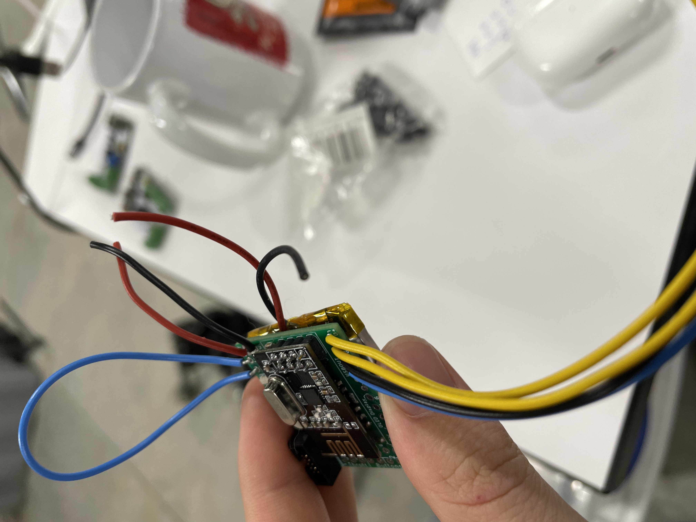
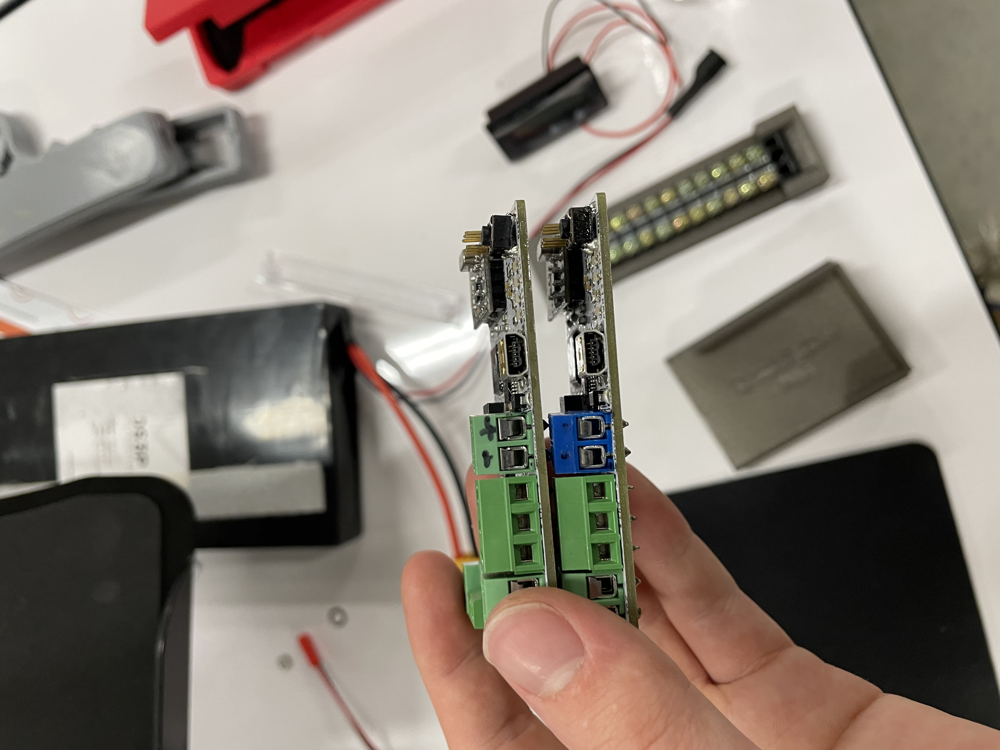
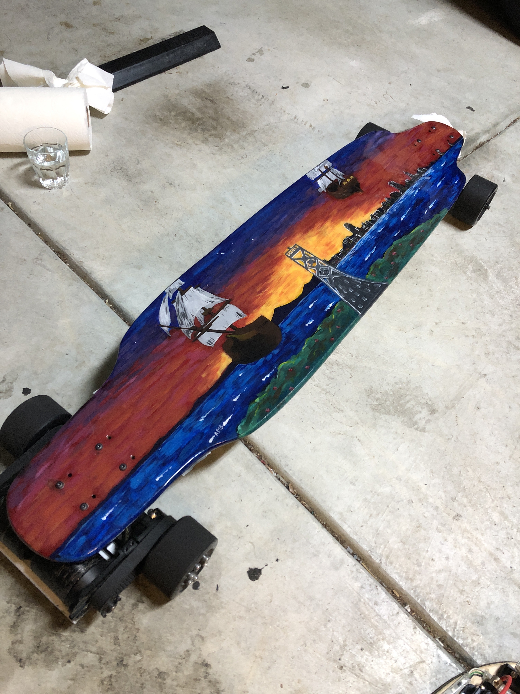

One of my favorite projects I've taken on over the past few years has been creating a high-quality, useable electric transportation vehicle to get me wherever I want to go - an electric skateboard.

# Project Background

After some progress on the electric bike in 2018 and 2019, I realized that further progress on that project would be difficult because of several constraints. Namely, the cost of working with larger electric bike parts combined with the difficulty of 
In addition, losing access to my highschool's robotics shop during the COVID pandemic made the machining of many parts impossible or costly, if I ever wanted to change something with the central drivetrain. In the end, with these constraints, I decided that creating an electric skateboard instead would be a better course of action.

# Version 1 - 2019

In 2019, I began work on the first version of the board. The initial idea was to have it be as small as possible, so that I could carry it with me easily. I ordered a 32-inch deck (shortboard, commuter style) in a design I liked, and began researching hardware I could use.

#### Although this version of the board would eventually end in (literal) smoke and flames, it taught me a lot about engineering a robust, reliable system that could withstand the rigors of the road.

I started by ordering some electronics and hardware parts from other designs I found online:
- VESC rev 6+ ESC (Electronic Speed Controller)
- Built-in hub motors for wheels, from Alibaba
- MBoards 10s3p 18650 Li-Ion pack, with BMS
- Arduino-based main control board, made by me
- Arduino-based controller, also made by me

At first, I started by testing some of the critical hardware that would go into the final build. This included the lights, and custom controller.

I knew that I wanted to make my own control software, so I was simultaneously assembling the physical hardware while also testing it on the controller:

The controller was designed around an Arduino Nano and had some interesting hardware built in. For control, there was a single joystick (which provided theoretically accurate and precise inputs but in reality was difficult to use) as well as a light sensor, which detected if my finger was over a transparent window on the bottom of the controller (to ensure that if I wanted to stop, or fell off, it would see light and therefore cut power to the motors).

In reality, neither of these original mechanisms worked well in practice, and I ended up having to control the skateboard inside of my pocket during the day to get the light sensor to work right. The large deadband on the joystick also didn't help: I found that I could command either no power or close to full power which wasn't suitable for the precision I wanted.

Version 1 of the skateboard, with in-hub motors (note orange wheels):

The rest of assembly proceeded fairly well, and I was able to test the board in the garage.

Finally, I had a version ready to ride!

#### The first incident

Although I don't have any footage of it, version 1 eventually had a major incident. I had observed with earlier testing that the hub motors had poor thermal disspation, due to the constrained surface area, and sticking the manufacturer rated current caused them to get very hot. As I was testing it in the neighborhood a day or two after finishing the board, I decided to test the board on a small hill and the motors ended up smoking and eventually catching fire. I believe this was due to the fact that as they heated up, they got less efficient, which caused more commanded torque (and current) to keep the same speed, which was a positive feedback look and caused the motors to get hotter.

Since all of the original electronics were working fine, I eventually decided to replace the hub motors with a new set of motors that were more efficient and had a more stable thermal behavior. I had a few different options, but instead of hub motors, for the next version I went with a belt drive train to transfer torque from the motors to the wheels.

#### The second incident

As I installed the new motors and began the process of testing, I was a lot more hopeful about the future of the project. The new motors were much more powerful, but importantly also had access to much better airflow under the board.

However, late at night in the garage as I was testing the serial link between the ESC and the onboard control computer, I had to make a quick solder fix and stupidly decided to leave the board on while I was doing it. I managed to completely short out the ESC and control computer, which were essentially impossible to fix with the current tools.

After all of these failures, I seriously considered giving up on the project, but eventually decided to continue. I ordered, instead of 1 expensive ESC, two cheaper ESCs that I could replace in the case that I fried another.

These worked, although they were slightly less reliable than the original ESCs, which required additional testing to ensure that I wouldn't have any issue.

# Version 2 (2020)

After 6 months or so of using the version 1 board for occasional rides around the neighborhood, I decided that I wanted something slightly more advanced. This included upgrading the controller I was using, and using the tested ESCs after the second incident.

The hardware had its own issues at first, including some radio errors:

But I eventually got the V2 controller and board working:

I also added some brake lights to the back to make it easier for cars to see me:

Finally, I had a working board!

#### The third incident

Once I had a working board that didn't catch on fire, the issues didn't stop there. The radio I was using to communicate between the board and controller had quite a limited range (NRF24L01+, around 10 feet). One day when the controller got low on battery while riding, the radio would start to drop packets and the board actually stopped responding to my commands. This meant that when I tried to stop behind a car ahead of me, the board actually kept going since it didn't realize that the remote had disconnected. Because of that, I fell off the board at fairly high speed, which didn't really hurt the board or the car luckily but I got a bit cut up. From that experience, I realized the software needed a more robust framework for detecting dropped packets or lost connections which would immediately cut power to the motor, which was implemented from here on.

# Version 3 (2021-2022)

I also wanted absolutely no compromises with the hardware, in order to ensure that it would be reliable. So I decided to create two custom PCBs, one for the controller and one for the board, which would regulate my speed, temperature, and battery voltage. I also began working with a friend who would also build a board to similar hardware specs as mine.

Both me and my friend also asked some of our artistically talented friends to do custom deck art for us. My board, on the bottom, depicts the San Francisco skyline, while my friend's board (middle, somewhat occluded) depicts a peaceful sunset.

This version of hardware has its own challenges, including a much more complex and compact controller, based off of my experience from the first two versions.

Part of the compact shape also came from the PCBs, which let me make the entire stackup much smaller.

Once I was done with everything including debugging and testing, I added some stickers to the bottom!

Final version of the board, including the custom deck art and belted drivetrain:

Finally, comparing the controller generations:

# Conclusion

Overall, the electric skateboard project was one of the biggest and most difficult projects I've ever undertaken, in terms of time, effort, and sheer determination to continue despite watching everything burn (literally) before my eyes. I learned a lot about how to make a board that would be reliable and safe through the many different iterations of the hardware and software, and especially the three major incidents that occured throughout the building and testing process. For all my effort, I'm really proud of the final result, and how both aesthetic and functional it is!

