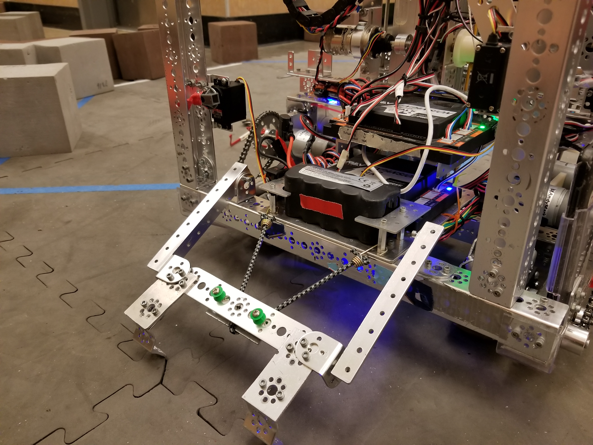
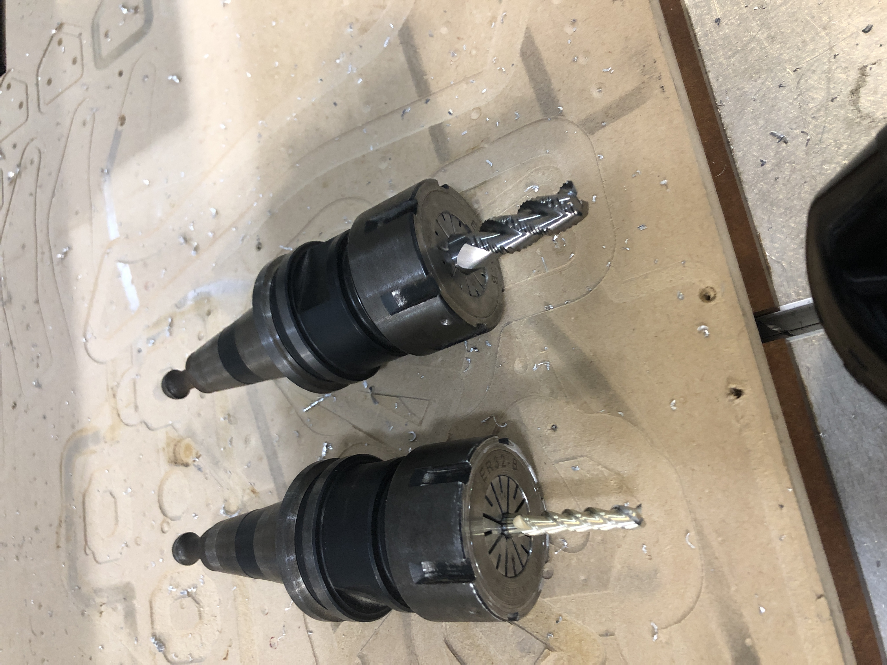
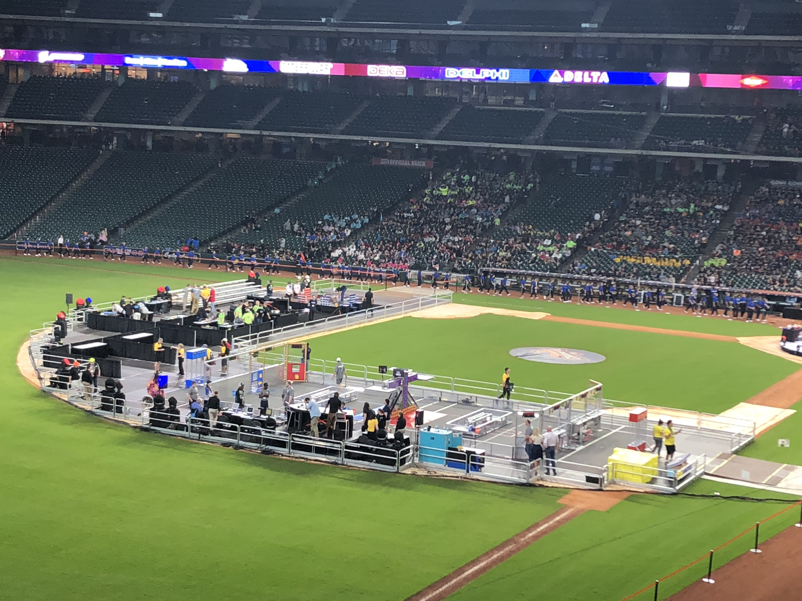
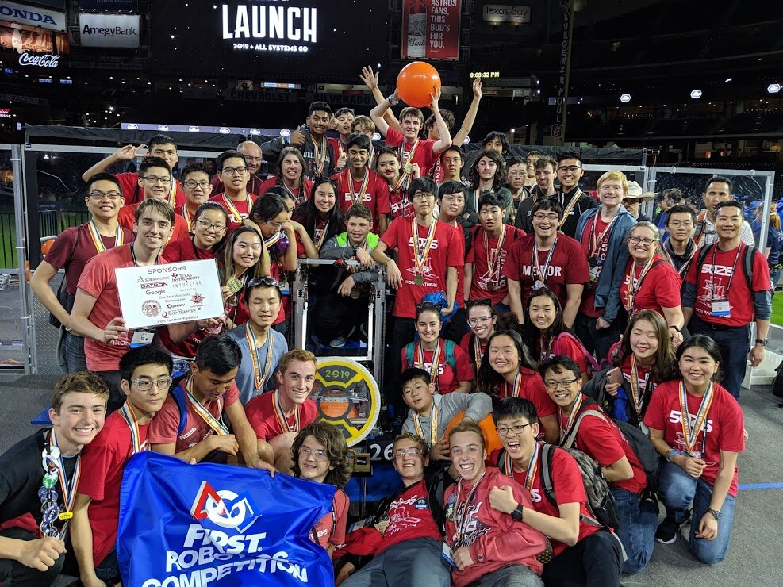

Doing robotics all four years of highschool was a memorable, rewarding experience that taught me a number of skills: leadership, perserverance, hard work, and engineering, among many other soft skills that come with working with a team of students to design and build a robot that could be used to complete a variety of tasks.

# Introduction

By way of background, I've included some snippets from the [Wikipedia page](https://en.wikipedia.org/wiki/FIRST_Robotics_Competition):

`The FIRST Robotics Competition (FRC) is an international high school robotics competition. Each year, teams of high school students, coaches, and mentors work during a six-week period to build robots capable of competing in that year's game that weigh up to 125 pounds (57 kg). Robots complete tasks such as scoring balls into goals, placing inner tubes onto racks, hanging on bars, and balancing robots on balance beams ... [the] goal of the program is to inspire students to be science and technology leaders.`

My school's teams, the Iron Panthers (FRC #5026 and FTC #7316), competed in both a larger robot competition, FRC (with robots weighing up to 125 pounds), and FTC (with robots weighing typically around 30 pounds).

# FTC Robotics

My freshman and sophomore years of highschool were spent working on our school's First Tech Challenge (FTC) robot, which was a smaller and less advanced version of the FRC (First Robotics Competition) robot.

The Iron Panther's motto is "Student Led, Student Run", which came through in everything that we did. From the begininning of the design process, which was ideation, we worked with mentors to advise us but did all of the design work ourselves.

I was elected to be the driver of the robot my freshman year, which meant I was responsible for driving it in competitions against other schools, which are scored on a point-based system. Competition, when we traveled to other schools to compete for points, was always an exciting affair.

Below are some pictures of our robot, "Stacker in the Rye":

After a few months of careful work and practice, we ended up travelling to the Super-Regional competition in Spokane after winning 2 local tournaments and placing at a regional, which was incredibly exciting!

We got to decorate our pit, used for tweaking the robot as needed during matches:

Competition was also an exciting but also nerve-racking affair, filled with both exhileration of seeing what we built perform but also nervously waiting to see if something would break or whether we completed a task we thought we could do.

They were also played on square fields covered in foam tiles, attended by officials like this:

Here's an entire match from the Daily City regional finals, where we were under pressure to perform to score the most amount of points to win the tournament:

Although we were eliminated at the super-regionals and didn't move on to the world championships, I'm still really proud of our season. The experience I gained definitely prepared me well for being elected FTC captain my sophomore year as well as well as performing well under pressure.

# FRC Robotics

My junior and senior years, I worked primarily on the FRC team, tasked with building a much larger robot which was also capable of doing more advanced tasks. We worked much the same as FTC, except that we were on a more constrained timeline: 6 weeks instead of FTC's multiple months until the first competition.

Our general process consisted of:

- Ideation, in which we would come up with a number of prototype ideas
- Scoring, in which we would score them using a Fibonacci scale for difficulty vs benefit
- Prototyping, in which we would create a number of different prototypes and continue to refine them in small teams
- Final design, and machining of the competition robot
- Continued tweaks during the season as we learned more about the success in competition

In the prototyping phase, we often built simple wooden designs to test core ideas, as well as electronics:

Then moved up to more advanced designs once the prototype was proven to be successful:

I was elected to engineering captain my junior year, which meant that I was responsible for most of the fabrication on the robot. In this role, I used our team's CNC machines to mill out a number of parts, as well as working on and referencing the CAD.

We also used a variety of tooling to make our designs work:

Once we had a robot ready to test, we often iterated to get things right. Below shows our first attempt at doing a successful climb and hang maneuver, which went somewhat wrong (the team member pictured was ok!)

It's clear that practice helped, comparing the result above with a much more successful later climb test:

We also rented out space with other teams to be able to practice on a full sized field, which was a great way to get a feel for the robot and test larger game strategies and mechanics. One such initial test consisted of calibrating our robot's ball shooting mechanism to aim at a goal with input from the drivers:

## 2019 World Championship Winners

During our most successful season (and the last normal season before the COVID pandemic), we ended up winning the FRC Houston World Championships with an all-California alliance! Having this experience was incredible; not only does FIRST host 400 teams and thousands of students that we got to meet and learn from, but we also got a chance to play the finals in Minute Maid Park, home of the Houston Astros.

There was definitely some nail-biting action: after losing the first match, our alliance won the second, which meant that it all came down to the final tiebreaker match. In person, the tension was almost unbearable, but the Youtube upload by FIRST also captures the event well.

Watch the tiebreaker match [at this link!](https://www.youtube.com/watch?v=MPu9UAzTZL4)

After we won, we captured team photo:

I also took some additional pictures of the experience at the World Championships from a previous season, where we placed 10th in our division.

## COVID

Although the last two seasons were cut off due to the COVID pandemic after our 2019 victory, work did not stop altogether with the robot. Our last team photo is below, taken immediately after our first competition was canceled in 2020 due to COVID. Although denied access to the shop, we continued to work in team member's garages, and we were able to complete a few tasks on our robot.

# Conclusion

Overall, I'm extremely proud of my four seasons as an Iron Panther and feel so lucky to have been part of such a talented team of students, mentors, and of course our coach Ms. Wade! Our team's motto "Student Built, Student Run" really shone through during my time on the team, and the experience gave me the fundamental skills to be a leader and a team player, not to mention learning the process of engineering, design, and fabrication.