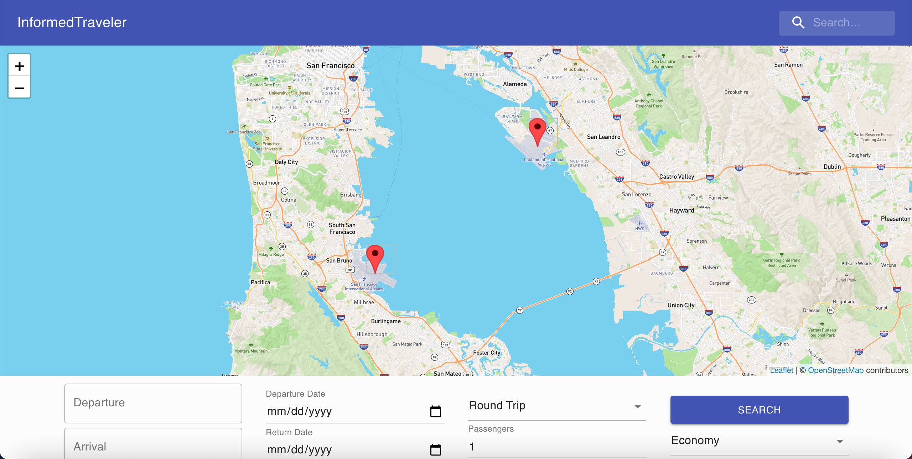

## Background
Attending my first hackathon was an absolute blast! After flying out to Boston for one of the very first times to meet my future roommate, Grayson, we decided to join a hackathon to see what we could create together in just 24 hours.
Given the COVID-19 pandemic, we decided to make a web application called InformedTraveler that could do flight planning between any two airports and tell you approximately what the risk factors involved in your trip were, from COVID to homicide to even corruption.

After we had recovered the next day, we were extremely surpised to find that we had actually won the hackathon, from a pool of 30+ contestants! Performing so well was an incredibly memorable experience and I'm so glad that we ended up participating.

## Submission Notes

Below is the actual submission prompt written by us to describe the application:

InformedTraveler is a web application written completely in ReactJS with MaterialUI. It was designed to answer a simple need - an air travel planning system that helps users account for various forms of risk and environmental impact. We categorized the risk into four indicies - Covid Risk, Homicide Index, Corruption Index, and CO2 Index.

On the home screen, users have two primary ways of interacting with the system.

A, the user can fill out the fields at the bottom center of the application. The required entries are arrival airport code, departure airport code, trip type, relevant dates, and their selected cabin class. After hitting search, a list of flights will be returned (sample data for today) from the origin to the destination. On the quick summary view, information like price, CO2 emissions, and two drop downs are present. The first, "Detailed Flight Information," breaks the flight down into legs. The detailed pane includes flight number, departure time, aircraft type, time enroute, distance, and departure date. Under the second dropdown, information related to risk is available. The Covid, Homicide, and Corruption scores are calculated on a 100 point scale from recent data.

B, the user can click on the search bar at the top right and enter a query. The closest match area and airport will be displayed with a map pinpoint and the same four risk/consideration statistics. This tool can be used to research any city or area in the world without the requirement of a trip or flight. The system will return the three key risk factors: COVID status, homicide index, and corruption index.

We believe that users will be able to make more knowledgable, risk-conscious decisions utilizing our platform for travel. We plan to continue developing to launch with live data on the web.

## Demo

[Link to demo on YouTube](https://www.youtube.com/watch?v=LzFqSHbzxKM)

## Screenshots

#### Front UI that's visible at beginning


#### View of several legs of a selected trip through the custom frontend


#### Sample generated report for a destination


```
Input Types for A:
  Departure/Arrival Airports: ICAO Code, IATA Code ie "KDAB" or "MCO"
  Trip Selector: Round Trip or One Way, which influences Departure and Return Date fields
  Departure/Return Date: Calendar selected date in mm/dd/yyyy format
  Cabin Class: dropdown selection
  Passgners: Integer

Input Types for B:
Search field: ICAO Code, IATA Code, Airport Name Query, City/Area Query
```

# Conclusion

Overall, participating in HTHS hacks was a great experience and absolutely led to closer bond with my roomate, Grayson. I'm very glad that we participated and hope that the idea of this application lives on in another way, as a service like this could be extremely helpful to consumers.