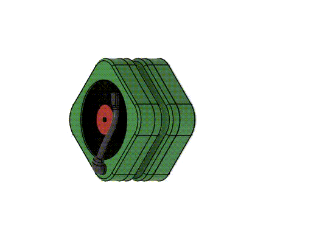

# MIT 2.008 - Injection Molding Yoyos

As part of the Mechanical Engineering curriculum at MIT, one class that's part of the core is called 2.008 - Design and Manufacturing II.

The class concerns advanced manufacturing techniques, including injection molding, CNC machining, and assembly (DFM). The final deliverable is to build 100 yoyos of a custom design, controlling for tolerances and variation.

We also chose a particularly difficult design, owing to the square "record player" shape. All thermoplastics have a non-zero CTE _(Coefficient of Thermal Expansion)_, which means that they shrink or expand when heated. This shrinkage happens in all directions (assuming isotropic material), and by geometric constraint the corners cause difficulties because they shrink less then the internal geometry/straight sections.

To fix this, we added internal stiffening ribs, iterated on our process parameters, and followed common injection molding requirements like adding a draft angle to improve our production rate & yield.

Here's an exploded view of our final design that shows more detail about the internal stiffening ribs and record arm press fit retention:

For more detail, here's one mid-term design review that goes over several details and challenges of the design:

![[MULTIPAGE] Team Deliverable Slides](ld.pdf)
