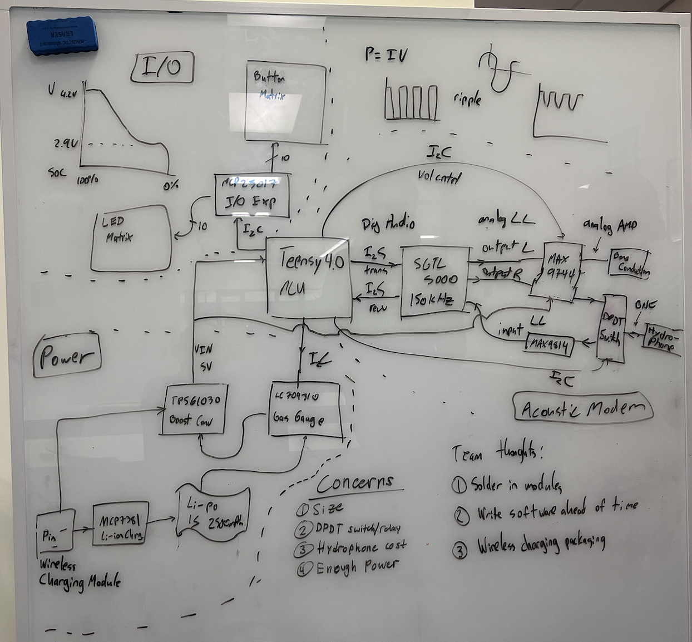
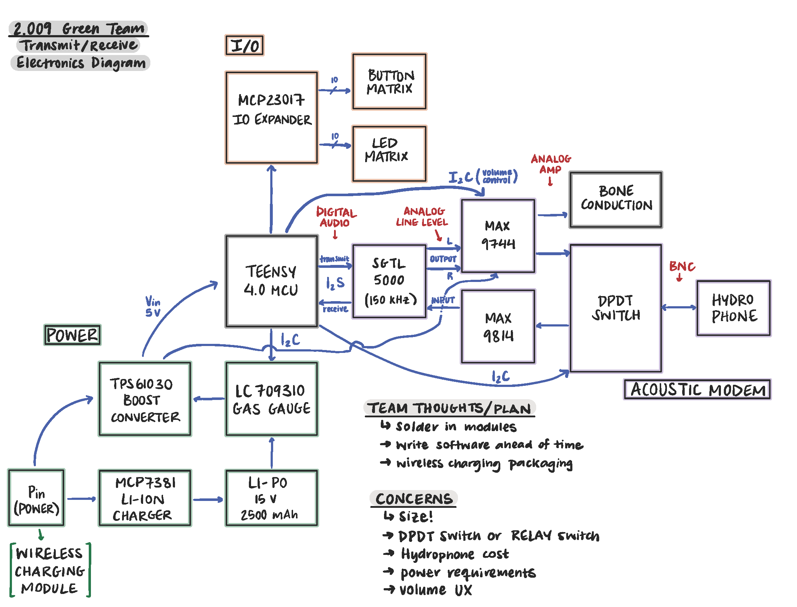
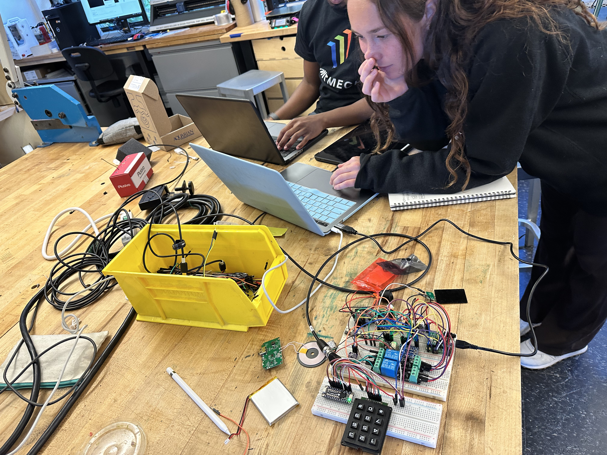

# MIT 2.009 - Senior Capstone

As part of the Mechanical Engineering curriculum at MIT, the senior capstone is called 2.009 - Product Development. Over the course of a single semester, each team builds a functional prototype of their product, which is developed from scratch.

This semester, we are building _Coral Connect_, a product that intends to connect divers to each other underwater.

The biggest challenge of Coral Connect is underwater communication. For this, we are building a custom modem that creates & receives pulses in the 25-35kHz acoustic band (just outside human hearing, but below sonar frequencies). The algorithm is still being developed, but will use a combination of _Packet Retransmitting_ and _Viterbi/Trellis_ encoding to ensure redundancy and reliability.

We first started with whiteboard brainstorming of COTS (Commercial Off the Shelf) components that could work to prove the concept, from vendors like Adafruit / Sparkfun.

This was then summarized into a full electrical block diagram, including the connections and protocols between components:

Update Nov 2024: We are currently putting together the first functional prototype! More updates to come as we make progress :)

