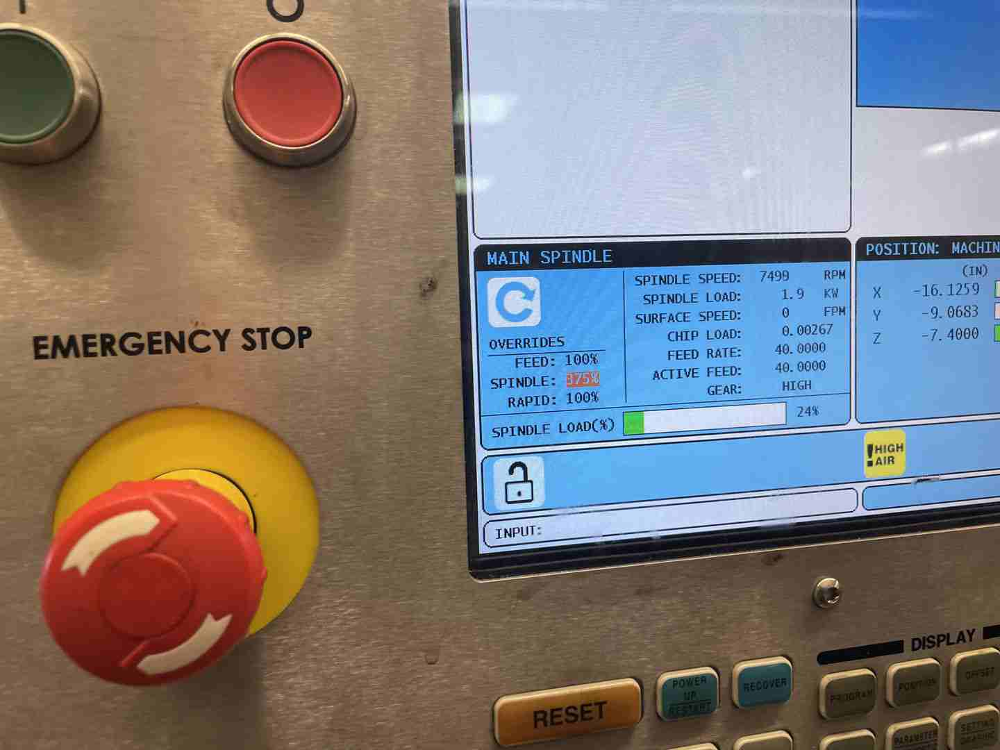

# MIT Formula SAE

In 2021, I joined the MIT Formula SAE team, which has been simultanously one of the most difficult and fun things I have done yet at MIT. This page serves to highlight some of the work I've done on the team, which has been without a doubt some of the most technical and interesting, as well as challenging that I've done yet.

## MY22 Braking System

This year, I'm responsible for the design and analysis of the braking system on our car.

Being a safety critical system, there are numerous steps to the design process to ensure that there are many redundancies built in.
Here's an overview of our design process:
- System architecture and specification
- Simulation and force analysis
- Load path analysis
- Hand calculations (establish basis for design)
- CAD (computer design of parts)
- FEA (computer analysis of parts)
- Manufacturing

The beginning of the process, that happened around November-December was specifying the system requirements. These were given to me, mostly from previous years as well as the FSAE rules manual of experience as:
- Decelerate the car as quickly as possible
- Maintain two redundant hydrualic loops to ensure safety
- Be able to handle 2000N of pedal pressure
- Ensure that the car doesn't become unstable from asymmetric braking forces

These requirements were taken into account when creating the next piece of the design, which was a Matlab script to calculate some of the forces that would be exerted on the entire system.

### Initial Analysis

I started with a teammate explaining the basic physics to me on a whiteboard:

Then, over the coming few weeks, I wrote out all the equations covering the braking system, including the calipers, hydraulic line pressures, master cylinders and pedal ratios.

Below is the analysis of the entire braking system, including the bias bar, which would be implemented in Matlab:

After the analysis by hand was complete, I programmed it into Matlab to give me results quickly, and allow me to test a number of different parameters and options quickly.

The full codebase is available on my Github at the following link: [FSAE Brake Optimization Script](https://github.com/aaroexxt/FSAE-Brake-Optimization), but the actual output of the script is the following:

The key parameters here are the following;

- Front - Rear Split: the difference in braking force between the front and rear of the car in order to stop the car at its maximal rate without causing any rotation due to imbalanced torques about the center of mass
- Reac and Long forces: Reaction forces at the tires, and longitudinal deceleration forces
- Max Deceleration: maximal deceleration of car at optimal braking ratio
- Line pressure, in the front and rear hydraulic loops
- Master cylinder bore sizes to translate pedal force to hydraulic pressure
- Bias bar distance required to get balanced forces
- Pedal ratio that interchanges between pedal and master cylinder forces

Once I had these numbers in mind, I was ready to move to CAD.

### CAD

Once I finished the Matlab simulations, I then began designing the braking system in CAD. For this, I used Siemens NX software, which was new for our team this year.

When designing the brakes, the first thing to think about was the loading path:

I then designed the entire assembly in Siemens NX, including the mounting points:

This assembly was then integrated with the master Wheel Packages assembly, to create the entire wheel unit:

Once it was done in CAD, all that was left to do was FEA to ensure that it would not break when subjected to the full braking forces.

### Hydraulic Diagrams

I also worked on several hydraulic diagrams based off of previous cars, which informed the ordering of fittings.

### Manufacturing

As of the time of writing this, the brakes have yet to be machined, so this is a work in progress!

## Epicyclic Gearbox

I also had the opportunity to work on one of our team's ambitious R&D projects for this year, which was the assembly and testing of an epicyclic (planetary) gearbox designed to carry the full load of a motor to one of the rear wheels.

Below are some pictures showing off the entire assembly:

Although I don't have pictures of the process, assembling the gearbox was certainly difficult - me and another team member developed a process involving heating parts of the assembly to 300C and cooling other parts to -10C in order to create enough differential expansion to make the ring gear in the center press in easily, even with a 20 ton press. Overconstraint in the assembly was a big concern, and that combined with the extremely hard gears (60 Rockwell) compared to the outer assembly made it extremely difficult to put together. But by perservering, we were able to make it work!

After assembly, we initially meant to use oil in the gearbox in order to lubricate it and prevent excessive wear. However, because of sealing issues, we eventually went with grease instead (which, due to its viscosity, does not leak nearly as easily with an O-ring seal).

Greasing the gearbox, however, was a messy process:

And finally, we had the first spin!

Finally, we tested it in a HAAS mill at 10,000 rpm for wear durability.

## Conclusion

Even though the work on the car this year is not yet finished, I'm already extremely proud of what has already been designed. The work I've done so far has been both challenging and rewarding in the best way possible - and has formed a basis of experience that's already helped me in my classes this semester and surely beyond.

I also want to thank the many members on the team who have helped me through much of this work, including Levi, Jorge, Nicole, Chris, Valeriia, and many others. If any of you are reading this, thank you especially!