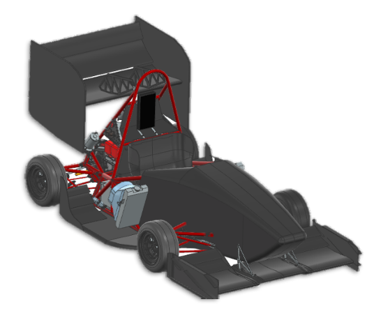

# MIT Formula SAE - MY24

After joining the MIT Formula SAE team in 2021, my final season on the team was in 2023-2024 as Powertrain lead.

In this role, I led multiple projects across many systems, including:

- Overall subsystem & timeline management, including uprights, wheel centers, brakes, rear powertrain
- Upright (wheel attachment) design and validation
- FEM modelling and simulation (NX NASTRAN)
- Design requirements and loads
- Static and dynamic analysis
- Design validation

This year of work ended in a pretty sweet side-by-side (taken at Formula SAE Michigan 2024):

_vs._

In particular, the Rear Powertrain and Uprights are well-summarized on this poster, which were presented at Formula SAE 2024 to judges as part of the Design Event. Click on them for more up-close detail!

#### Wheel Packages:

#### Rear Powertrain:

(Updated Nov 2024): I was invited to give a talk at the **MIT Mechanical Engineering Family Weekend** to discuss the year's design cycle and the engineering process that went into it. Instead of a full technical writeup, which I intend to write in the future, the slides are an excellent summary of the year's work and process.

Talk slides are below:

![[MULTIPAGE] MechE Talk](MechETalk-ForWebsite.pdf)

If you've made it this far, here's some cool GIFs that a team member (Seb) took of me using an analog 3D camera (I think the RETO 3D?), which takes 4 simultaneous exposures!

This is of me and Hez holding the wheel package/uprights for MY24 :)
