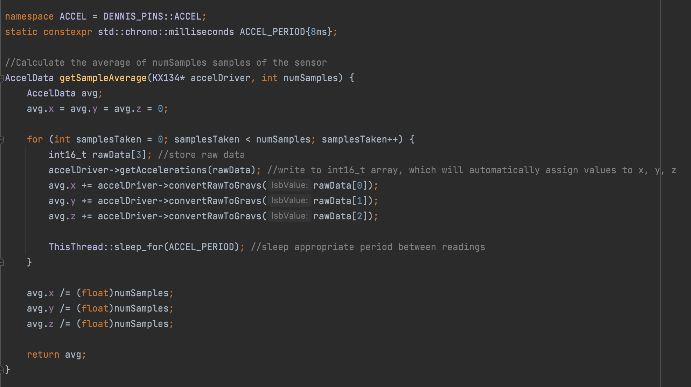
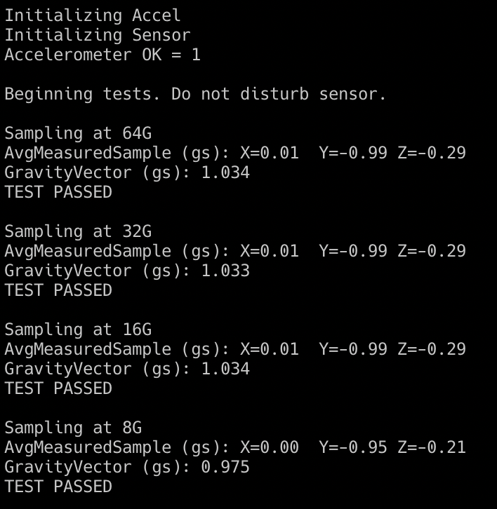
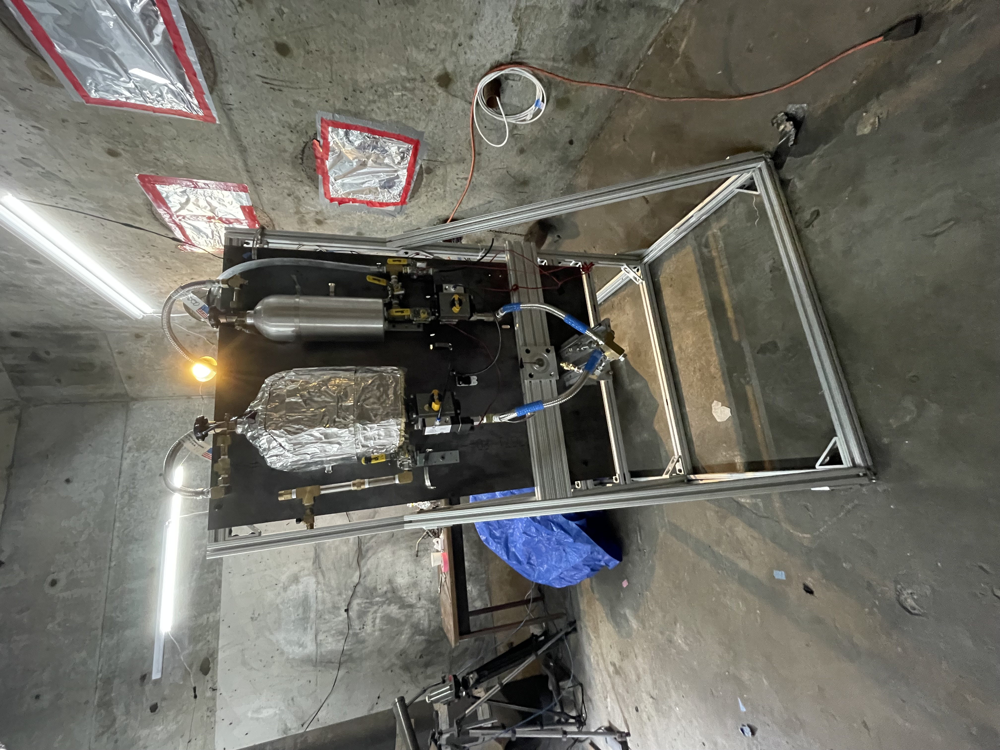
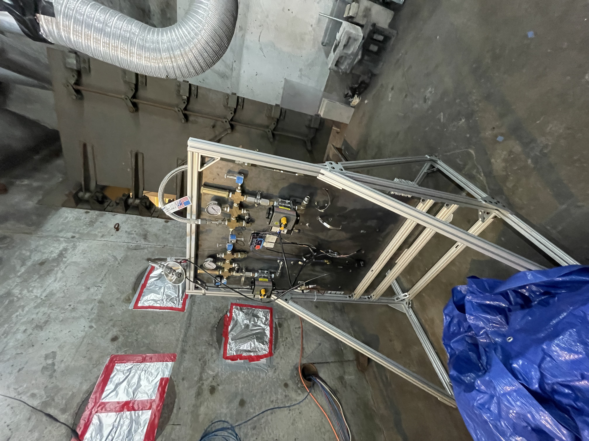

# MIT Rocket Team

I joined the MIT Rocket Team in order to work on high-reliability rocket avionics on a larger scale than some of my previous projects like Zenith, as well as to get introduced to some more advanced techologies in the aerospace industry like bipropellant engines.

## Avionics

Most of my time spent on Rocket Team was working on avionics for upcoming rockets based on previous work. Compared to previous years, there's been a lot of work on new systems due to designing a completely new avionics computer, DENNIS (Deep-fried Numerical Navigation and Ignition System).

My primary task this semester was to work with a new form of RTOS for the team, MBED-OS.
I developed firmware for the rocket that interfaced with a high-g accelerometer, the KX134 as well as writing unit tests in GTest and test scripts to ensure the sensor was working once installed in the hardware.

During the process of writing the code to work on the sensor, I went through numerous code reviews and refactoring sessions with members of the team, which was extremely helpful in coming up with the final, well-tested result which worked on the first try on the real hardware.

Below is a code sample from a piece of the larger program, which averages some data for the sensor for calibration.

I also have some results from the hardware test scripts, which ensure the sensor reads valid values at all of its internal ranges (sensitivities) as well as having a correct initialization sequence.

Ranging test:

## Bipropellant Engine

I was also involved at the start of the semester with getting a 1.6kN liquid bipropellant (Ethanol/Liquid Oxygen) engine up and running.

We're testing our engine on a test stand in the basement of one of MIT's engineering buildings. Due to COVID, we had to assemble and test the stand after a year or so in storage.

After assembly, we had the following in our bunker:

Currently, the team is performing cold flow water tests before running it with combustible fuels. 

## Getting a L1 Certificate

The team also sponsors some members to get their L1 rocketry certificate in which they have to build, fly, and recover a rocket.

My rocket for this year, christened the _"Flaming Beaver"_, was launched in New Hampshire at a local rocketry convention.
After completing it at MIT, we drove it over to be launched:

After checking that everything was in order, it was given the green light and launched!

Standing just before launch:

Launch itself!

Then, it landed in a river a half mile or so away from the launch site, and after a bit of searching me and a friend found it!

# Conclusion

Overall, joining Rocket Team has been an education and fun experience between gaining knowledge in the testing and assembly of larger-scale rockets to the deployment and testing of robust RTOS-based software designed to operate in harsh conditions. Even though I'm no longer on the team due to time constraints, I'm glad to have had such a great semester working with everyone!

Additional photo credit (cover photo): MIT Rocket Team