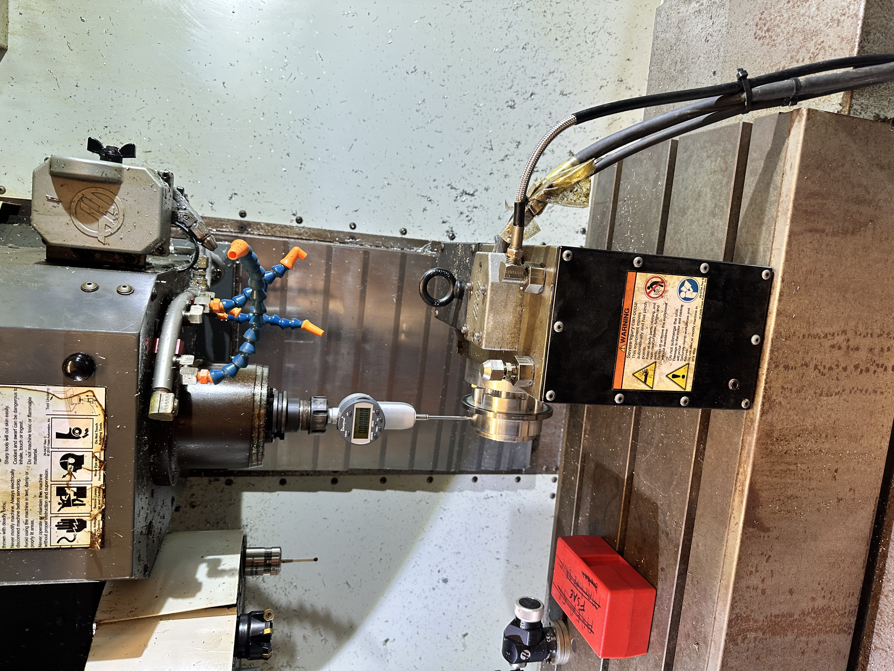

# Machining Challenge

Manufacturing parts is always a challenge, and I wanted to highlight three difficult/interesting parts I've made over the past year or so on my Formula SAE team's CNC machine, a Haas VF-2.

### Overview: What is Machining? / Terminology

In engineering design, there are often two main approaches to making parts. These are subtractive (take a big block of metal and remove material until it is the shape you want - i.e. CNC milling) or additive (build the part up from nothing, often layer-by-layer - i.e. 3d printing).

CNC milling, in particular, is a common subtractive manufacturing technique, where a part designed in software (CAD - computer automated design) is then run through another program called CAM (computer automated machining) which generates paths for the machine to follow to mill out the part. Designing a good part that is not only functional but also easy to manufacture requires both analysis and intuition - it must be manufacturable while also meeting all of the design requirements.
This is known as DFM (Design for Manufacturing) and DFA (Design for Assembly), which is critical to consider when designing your parts.
Here, I will now highlight each part I made with a brief explanation of the particular challenges of each one.

## Part #1: Formula SAE Carriers

The carriers are the inner part of our gearbox that attaches to the wheel. Mounted onto them are three lug studs which connect to our wheel.
The CAM was particularly difficult because of the 4th axis. I needed to make
I also had to write a custom "post-post" processor in Python because on the particular machine we were using, the 4th axis has a brake that has to be engaged with a special G-code command in order to take full milling loads.
We started by dialing in our zeros on the 4th axis:

Then, after running, we had the pockets machined:

And finally a finished part:

We then installed the carrier into the upright:

## Part #2: Formula SAE Retaining Nut Tightener

This part wasn't as difficult as the carriers, but I just liked the final look of it. I decided to spice it up a bit by rounding the corners, and using 3D surfacing tools to add a really nice machine chamfer. I also used 1/4" and 1/8" carbide endmills to create the pocket for the torque wrench on the back side, and of course also chamfered it really nicely.
It was done in two operations, top and bottom, being careful to not crash the tool:

## Part #3: Personal Project

This part was particularly difficult firstly because of the number of operations - 4 in total, on each side.
Two of the faces also had fairly intricate geometry that required careful tuning of my chosen feeds and speeds in order to get both a nice surface finish and little chatter. I settled on a 1/2" carbide endmill for roughing, then went in with a 1/4" carbide endmill, in two passes (1 roughing pass, leaving 3 thou wall stock, then a finishing pass). This strategy worked well, although if the pockets were any deeper I would have run into trouble from tool stick-out. This problem was addressed during the design process though, as I never placed a surface's face more then 1" below the top of the part to minimize chatter. This required me to get pretty creative with how I was going to get the water to flow from the top of the part to both sides - I settled on drilling out 6 small holes in each pocket.
I started with CAM and raw stock:

A large 4" x 4" x 6" block of aluminum, faced manually on a knee mill was used for the stock:

Then proceeded through the ops, starting with the top roughing:

When it was finished:

Then, I flipped it onto its side and proceeded with the second operation. The challenge here was the small pin-like features, which were adaptively cleared:

And continued with the last 2 ops:

I then tapped the legs and side plate mounts to a 1/4-28 thread:

And finally mounted the side plates to finish the part:

## Conclusion

Each of these projects was a challenge in its own way, and I learned a lot from each one - including 3d surfacing, 4th axis machining, and how to write a custom post processor. I learned a lot more about machining quickly and I look forward to making more parts!
