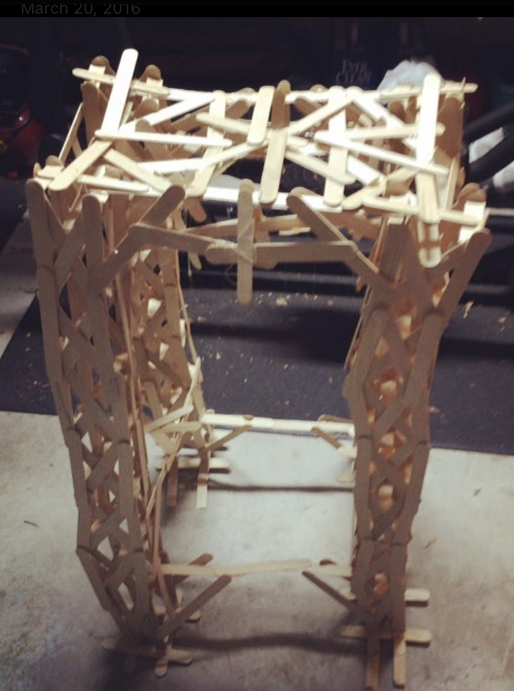

This chair is the earliest project currently on the site, and represents my dedication to a slightly esoteric idea: building an entire chair out of popsicle sticks.

In 2015, I was just getting started with a workshop when I realized that I didn't have a chair, and what better way to make one? All I had at the time in terms of fabrication was popsicle sticks and a hot glue gun, and I decided that surely that was good enough to make a chair that would hold my weight.

Eventually, I did mostly succeed! Although the chair was eventually scrapped, I was able to sit on it several times without it breaking.

The final chair in all its glory:

