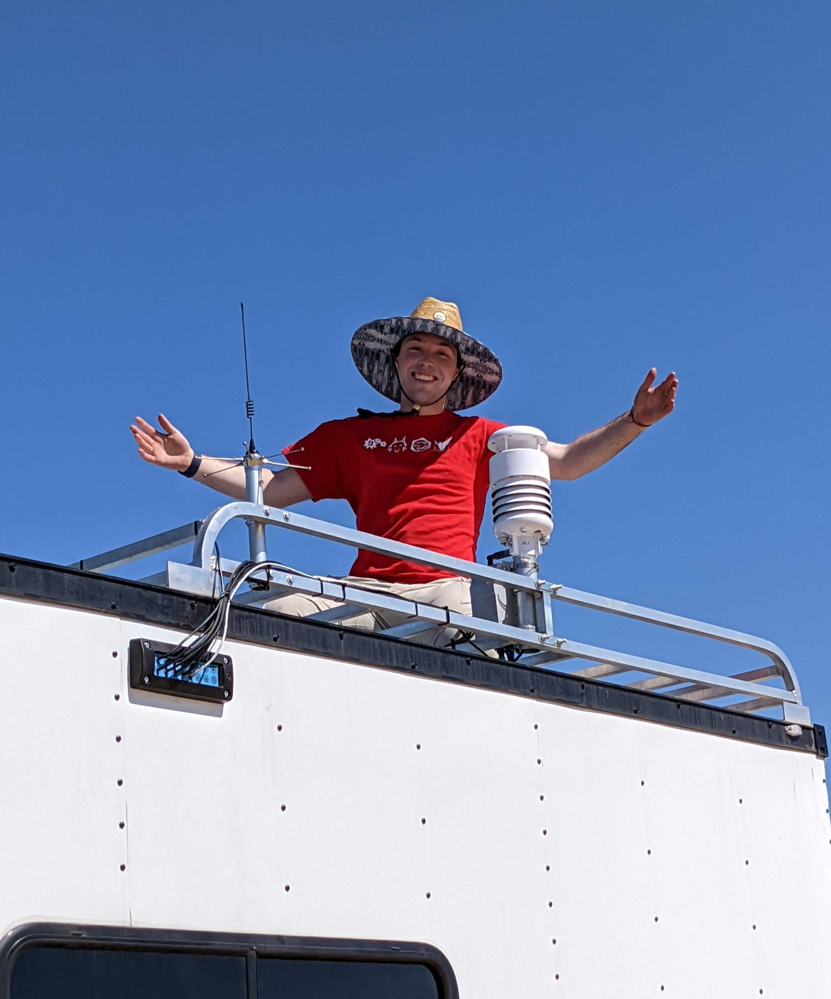
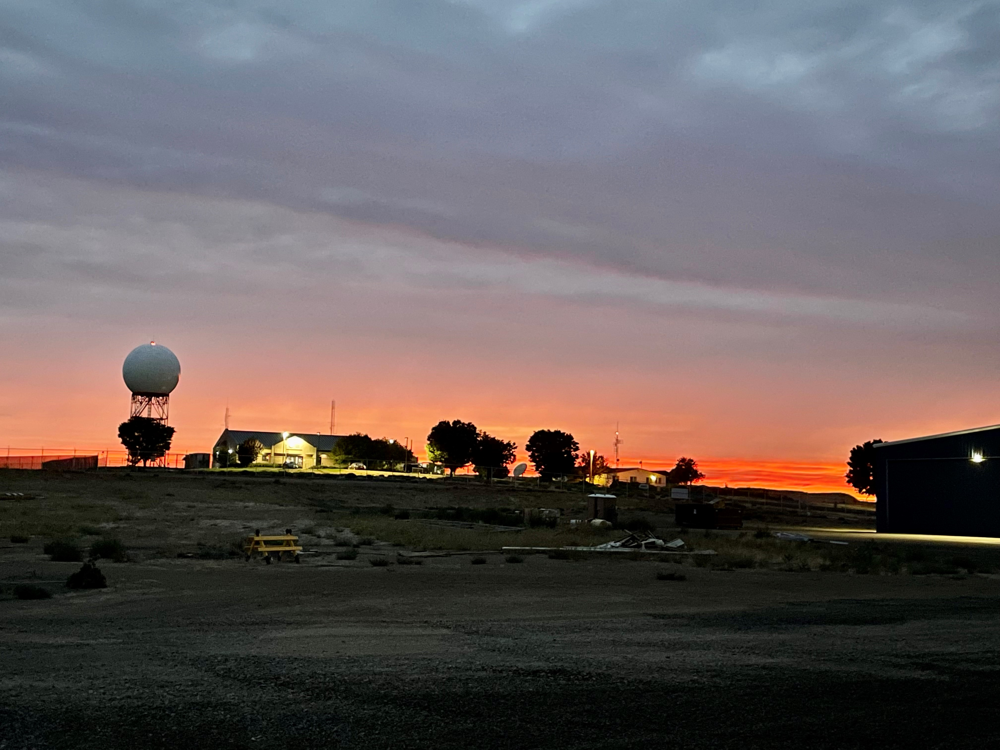
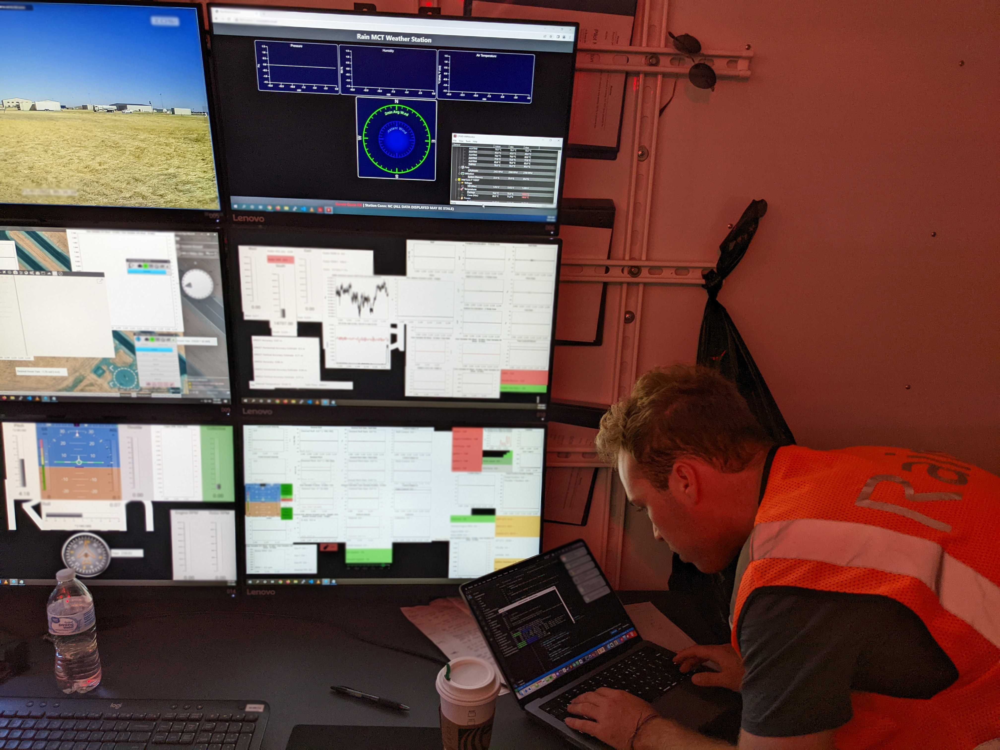
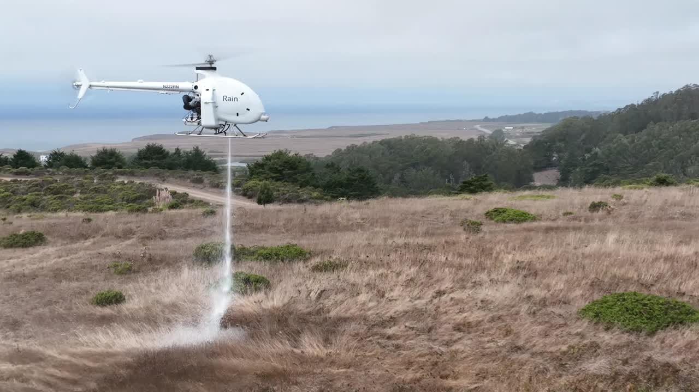
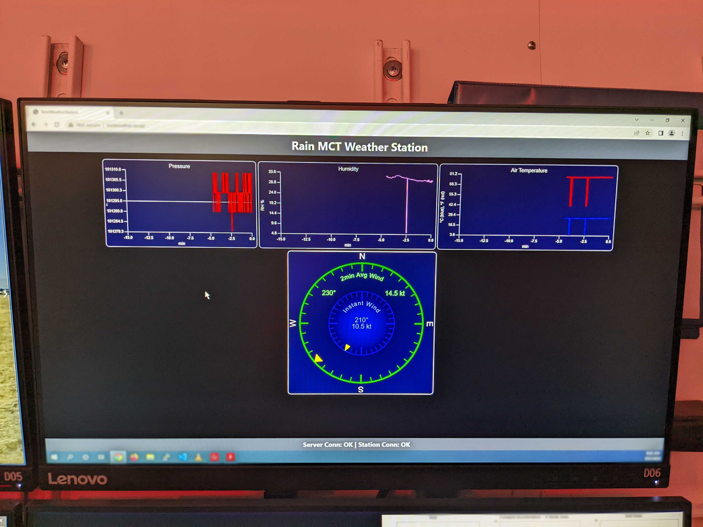

# Rain

This past summer I had the chance to intern at Rain Industries in sunny Alameda, CA focused on developing autonomous vehicles dedicated to supporting wildland firefighting efforts. I wanted to make a short post highlighting my experience at the company as well as some of the exciting problems I had an opportunity to work on while there. Read on to learn more!

## Summer 2021

I began my journey at Rain in the summer of 2021, shortly after completing my final year of high school. The trip from California to the beautiful but rugged town of Pendleton, Oregon took roughly two days and offered breathtaking views along the way.

For some background, Rain is a company dedicated to solving the wildfire problem facing the American West and the world, the effects of which are increasingly being felt in high-density, high-risk areas like California. Fundamentally, this means that they are a technology company - focused on the development of hardware and software systems to contain wildfire ignitions quickly; this includes the use of autonomous vehicles, specifically helicopters. One of the things that I found most impressive about Rain was their commitment to their mission of preventing catastrophic wildfires.

Their motto, "Every Wildfire Starts Small," reflects their focus on quickly containing ignition points in order to reduce the size and severity of wildfires. The Rain System is designed to contain ignitions within 10 minutes of detection, which I believe is a really innovative and important approach to fire management. The intention is that Rain's autonomous helicopters are equipped with advanced sensors and software that allow them to identify and target specific areas for fire suppression. This not only makes them more efficient and effective, but it also allows them to operate safely in challenging environments, which is vital when it comes to firefighting.

All of this sounded quite exciting to me, but at this point there was only an initial prototype made out of a hexacopter drone and a custom fire suppression deployment mechanism. The team at this stage was focused on scaling this up to the next milestone - a vehicle testbed, not too far removed from a full helicopter that we could use to refine the underlying technology. This ended up taking the form of an early vehicle, affectionately dubbed "Acacia", that was designed from the ground up to be iterated on quickly. Initially, I worked on just vehicle avionics, which included planning and prototyping wiring system for the MKII test bed vehicle. The team at this time was small, just me and a few other dedicated members, including [Ephraim Nowak](https://www.linkedin.com/in/ephraimnowak/) (Chief Engineer) and [Bryan Hatton](https://www.linkedin.com/in/bryanjhatton/) (CTO). The small environment made prototyping and quick iteration easy - in the short six weeks I spent there the "vehicle" went from parts on a table to an assembled prototype.

Then, as the vehicle started coming together, I also designed a few parts in CAD, including a part to mount servos to control the engine throttle, which was later tested on the ground.
I also wrote firmware for a COTS device onboard that helped communicate between the master avionics computer and the power management subsystem, as well as some testing with an Arduino and various actuators we ended up using on the vehicle, including a CAN-controlled linear actuator.

I worked mostly independently, due to the size of the team. Overall direction and project progress was supervised and discussed in daily stand-up meetings, but I was free to attack a problem with whatever we had on hand, of course drawing on the expertise of everyone else when needed.

Because of all of these factors, this first summer was a great learning experience and I ended up coming back for a second summer after my freshman year at MIT.

## Summer 2022

My second summer started out much the same as the first: with an ambitious deadline, getting a vehicle to fly in as short a time as possible. This time though, the vehicle was bigger and the stakes higher. We had moved onto "Balsa", a demonstrator aircraft that would carry retardant and attempt to make real flights to a simulated fire-fighting altitude.

Over the past year, the team had grown significantly, and I was able to work with a much larger group of engineers. I had also spent more time on mechanical design and fabrication as part of MIT's Formula SAE team, and was excited to put my skills to work.

As the ten-week internship proceeded, one thing I found exciting is that my projects were often motivated directly by the needs of the industry - in one of our meetings with a fire fighting captain, the need for a way for first-responders to view our system’s status in real time became obvious. There were a few solutions on the market, but I was tasked with trying to build our own that would fit better with our vehicle platform.
That same day, I started with the basic goals of providing situational awareness for firefighters, and to allow monitoring and tuning system performance. Iteration converged quickly, building on open-source tools and frameworks like **Node.JS**, **React**, and **h3**. Often, we worked faster by working together - one afternoon, I was struggling to get the backend protocol we used for communication with the vehicle up, and was able to get it resolved in an afternoon with the help of one of the software engineers who had more experience with that platform. The next day, we did the first live visualization of a small heat source with our drone-based test platform.
This highlights another reason why I really enjoyed my time at Rain - all of the engineers that I interacted with were often both extremely competent and extremely helpful, and dedicated to iterating quickly to serve the needs of our mission.

I also had the chance to go on testing trips, where I tried out being a RSO (Range Safety Officer) as well as assisting with setup and takedown of the equipment. I also got to see the vehicle in action, which was really exciting - validating all the hard work I and the rest of the team had put in to get it off the ground.

Sometimes new and exciting problems came directly from the needs of these testing trips. On one testing trip, the testing team identified a discrepancy between the local Automated Weather Observing System (AWOS) weather data for the airport we were testing at and the real conditions near the launch site. This led to another project: integrating our own weather station into the mission control trailer, which I was able to do in a week or two by building a web server running Node.JS and serving an interface that communicated with a commercial weather station on the roof. This was a great example of how the team was able to quickly iterate on a problem and come up with a solution that worked for us.

In conclusion, my two summers at Rain were filled with valuable learning experiences in various engineering disciplines, including electrical, computer science, and mechanical engineering. It also allowed me learn and grow in these fields while also gaining insight into the value of teamwork and dedication. The innovative project we worked on provided a chance for me to be part of something meaningful and exciting, and I am excited to see what the future holds for Rain as they strive to combat widespread wildfires.
