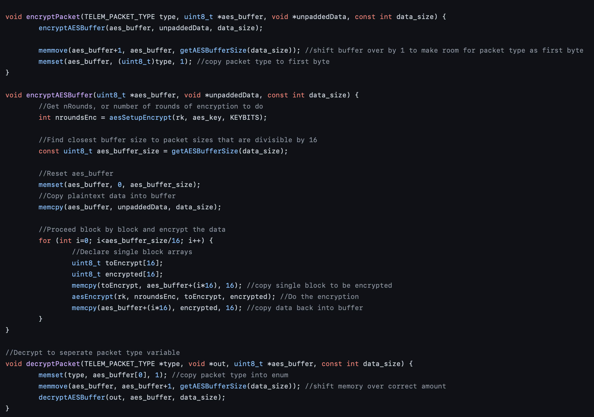
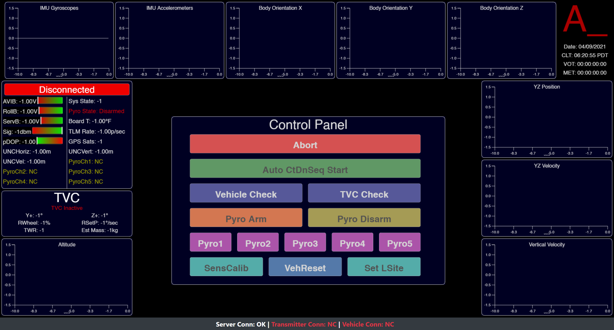

# Rocket Ground Station

This project was intended to make interfacing with Zenith much easier by introducing a GUI-based system instead of the command-line interfaced used at the initial flight trials. Although completed after the first test launch of the ZENITH system had already completed by the time that I began writing this code, it still serves a useful purpose in future launches and teaching me a lot about real-time systems.

## System Architecture

The overall system architecture is as follows:

Computer <-USB-> Ground Station <-SPI-> _Telemetry Link_ <-SPI-> ZENITH

In this way, the computer and ZENITH can communicate in real-time.

In order to get this data exchange to work, there are several different programs that run.

#### ZENITH/Ground Station

On ZENITH and the ground station, which are both based on the same hardware, there is a C++ translation layer that encodes and decodes the packets on either end of the radio link, which is based on the NRF95 LoRa radio module.

The encryption is based on the widely used and secure AES-128 protocol, with hardcoded keys in both the receiver and transmitter that don't change. This works well security-wise because in order to even potentiall gain access to the key, physical access to the device is required, and this keeps the communications simple without having to do something like a handshake/key exchange upon every reconnection.

According to one [google search result](https://crypto.stackexchange.com/questions/48667/how-long-would-it-take-to-brute-force-an-aes-128-key), brute-forcing a worse-case AES-128 key would take around 2,158,000,000,000 years, while the universe has only been around for 13,799,000,000 (156.4x!). So I think we're plenty secure enough unless some other vulnerability is discovered in the AES protocol.

However, the AES protocol is also based on a block size of 128 bits (16 bytes), which adds complexity due to all messages having to be padded out to that length. I based my actual encryption on an existing library that works on each block, but wrote entirely new code to pad sensor data into correctly-sized blocks and then sending them over the radio link.

#### Ground Station/Laptop

Once the data is received by the ground station, it's sent over USB serial to the computer, which further stores it internally in a local server. The main UI is written with web technology and hosted with Node.JS locally, and then deployed into an application with Electron. In this way, it's possible for other applications to interact with the server backend using Websockets if I ever wanted to build on the underlying technology.

## Development Ideas

During development, I also built multiple versions of the frontend to see how they would look. I made an interactive 3d renderer which could render the rocket in real time, which I later scrapped for a more useful large button panel.

The final version of the UI looks like the following, with real data being plotted in every graph segment:

# Conclusion

Building the interface for ZENITH was a significant amount of work, but I'm extremely proud of how it came out and the final form of the UI. Balancing function, form, and utility was difficult, but I certainly learned more about how to make a reliable, easy to use interface that's capable of monitoring data and launching rockets securely and remotely.