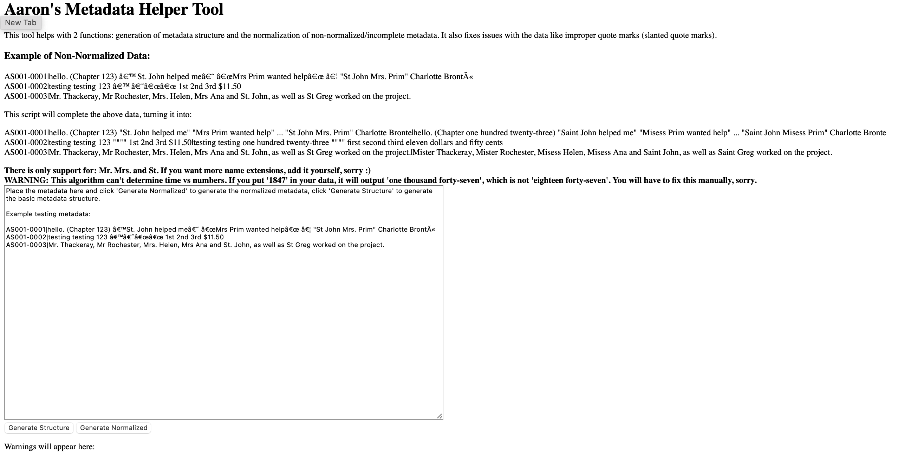

Tacotron was a project where I explored Neural Networks with the goal of cloning my own voice. In the process, I learned a lot more about natural language processing, as well as the difficult task of making a suitable dataset to train a network on to get a good result.

I started with some inspiration from others: Keith Ito's [Tacotron repo](https://github.com/keithito/tacotron), based on a paper by Google. While his implementation provided some speech models, it gave little instruction on how to actually create a dataset for doing speech training, so I was effectively on my own.

For the dataset itself, I used some publicly available and well-known novel such as Jane Eyre, by Charlotte Brontë. Below are some clips I recorded for the final dataset, which were transcribed and used as training data:

Once I had an entire hour (in fact, several) of raw audio recorded, I spliced it into segments as shown above manually using Audacity, then matched up the audio with publicly available text from the novel.

I also wrote a helper tool that helped take some of the weird formatting in the original novel and make it into neural-network friendly text. It also did basic text processing like take all the numbers in the text and expand them out to letters (679 -> six hundred seventy nine).

Once I had the entire dataset, including the metadata file in the right format, it was just a matter of training. I started by training my own model from scratch, but the results there were poor enough to not merit any further progress (I suspect this was caused by the dataset not being large enough, or something like that). Instead, I finetuned an existing model on my new data, which resulted in a much better sounding audio file, albeit with some odd artifacts that make it sound like I have a sore throat.

In total, it took around 2 weeks running 24/7 on my home-build PC to get any sort of good result (probably due to the outdated hardware/non-optimized software).

Overall, though, I'm fairly proud of the result and by comparing the audio sample below with my real voice, I think that they're similar enough to where you could tell it was me!

See if you can tell which sample is which - note that the voice sample was recorded in 2022 and is much more recent than the audio used to train the model, since my voice has changed slightly.

Hint: left one is me!

Finally, I also modified parts of the original Tacotron code to support my new dataset, as well as a better inference system. Pictured is a screenshot of some of the code that does speech synthesis on the existing model.

# Conclusion

Overall, I'm extremely proud of the work I did on this project, and I think that the final result speaks for itself as sounding fairly similar to my voice. Even though I knew next to nothing about neural networks and datasets when I started, throughout the entire process of creating and training I learned a lot about how AI works.