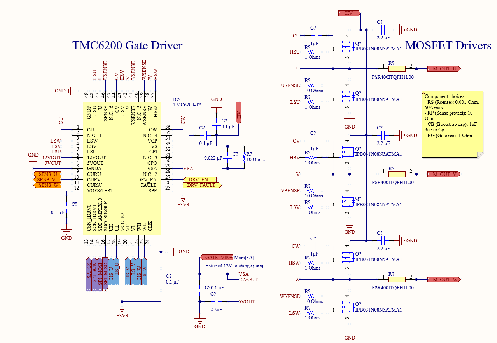

# TeensyESC

Over MIT's IAP (Independent Activities Period), I designed a brushless motor controller for the class 6.PCB (EC.S02) - [The Art and Science of PCB Design](https://pcb.mit.edu/). It was designed in Altium Designer, a popular and industry-standard design tool.

I based my design around the popular [Teensy 4.1](https://www.pjrc.com/store/teensy41.html), integrating its main processor, the IMXRT1062JV6B into my own custom design. The chip is a 600MHz ARM Cortex-M7, with 1MB of RAM and 2MB of flash memory. The high level specifications for my design are as follows:

- Supports up to **48V, 50A** with active thermal management (2-2.5kW peak power)
- **CAN bus, SPI, I2C** interfaces for communication with the main processor, and flexibility with implementation
- 3-phase brushless motor control with 6 PWM outputs
- 3-phase low-side current sensing
- **2x USB-C** (host and master) ports, allowing for connection of external peripherals such as keyboards, mice, and joysticks. Supports Type-C power delivery up to 1A

I also chose the TMC6200 gate driver paired with IPB031N08N5 MOSFETs, which allowed me to gain familiarity with the popular (and available) Trinamic drivers as opposed to the traditional DRV8302, which due to supply chain difficulties is very hard to find these days.

You can find all of the hardware on my Github [here](https://github.com/aaroexxt/TeensyESC), and the rest of the writeups for the class [here](https://pcb.mit.edu/projects/), on the class site.

Finally, the full paper I submitted, describing my design requirements, process, and simulations is below, which I intend on revising as I finish the layout and test the board!

