During the Spring 2022 semester, I was hired by [Zing Drone Delivery](zingdrones.com) in order to design a custom winch system for delivering packages quickly and reliably via drone. Solving this problem took several months of time between classes as well as a lot of iterating to converge on a successful design. Hopefully, by the end of this document, you understand a little bit more about the process the team at Zing and I used in order to complete the project.

**Note: I was the sole engineer working on this project, so all of the work you see below was designed by me.**

Here was the final design, as a rendering! Real hardware does exist, but I can't show it.

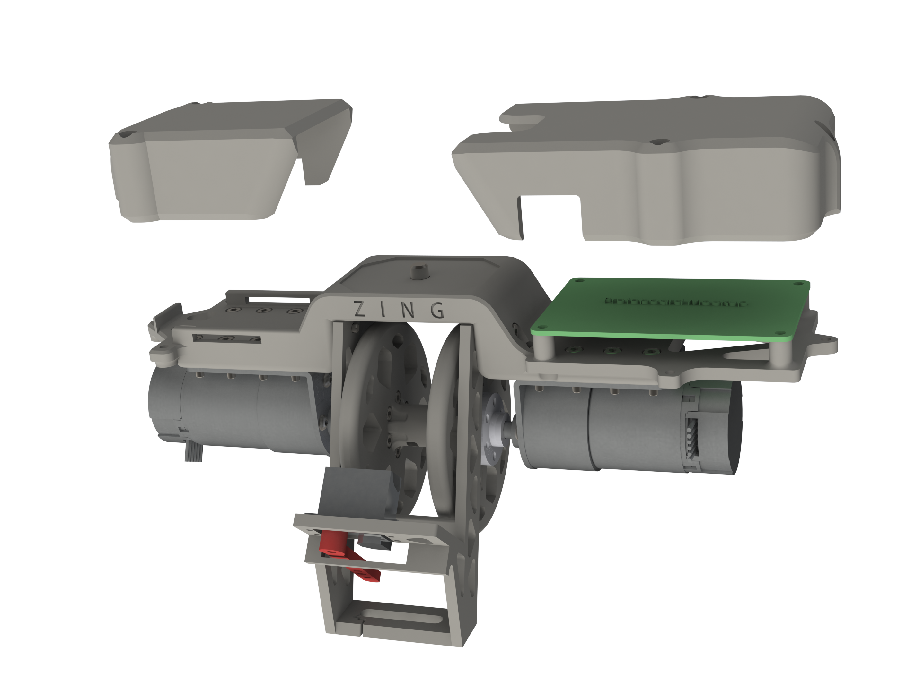

## Ideating

We started with establishing an initial set of product requirements, which included parameters for height, weight, and battery life.
I then came up with a document that described the planned electrical system, software stack, and even some initial "hand calculations" to get an estimate for mechanical loadings that would accomplish all of these objectives:

## Prototyping

After several weeks of iterating more fully on these concepts, electrical design began in earnest with designing a layout in PCB design software Eagle. 

This process was also complicated by serious supply issues, in that we needed to be assembling and testing a prototype quickly, while different parts were going in and out of stock. In the end, I settled on a fairly modular design that allowed quick component swappage in the event of a shortage, and actually designed two completely seperate versions incorporating different motor drive circuitry to allow some ordering headroom.

Below is an old version of the schematic (new one is much more complex) to show the different components laid out categorically.
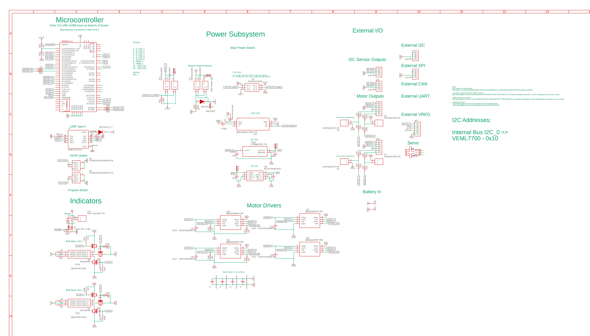

At the same time as I was making and iterating the schematic, I also build a hardware prototype to validate the design decisions that were made and test an actual motor with the 3d printed parts and system. To do this, I used a proto-board, some wire, and all the patience I had in a 8-hour marathon of soldering, testing, and debugging.
All the parts on the board were also COTS (commercial off-the-shelf) from Pololu, which removed the work of debugging the modules themselves which would have been needed with a fully custom design.

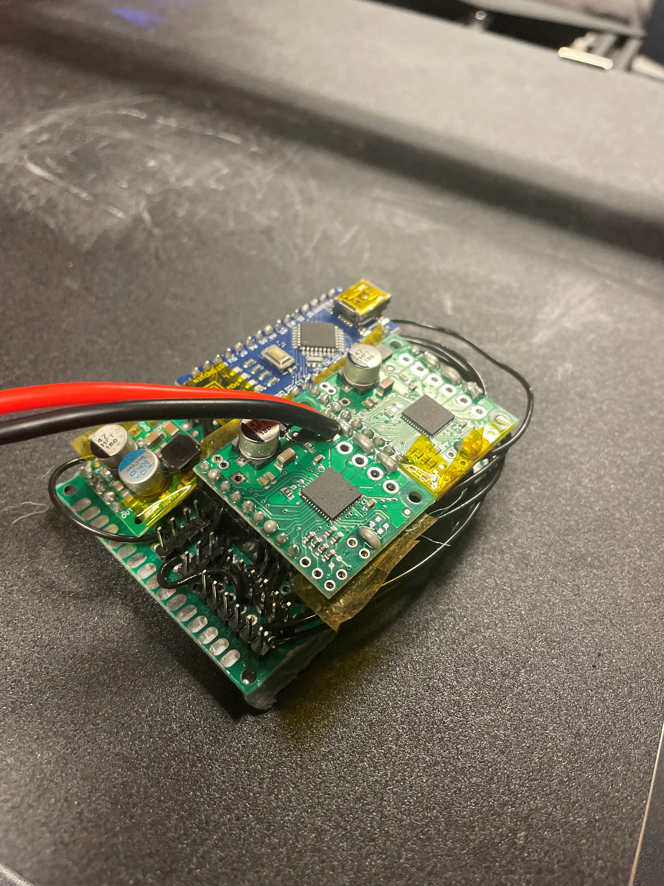
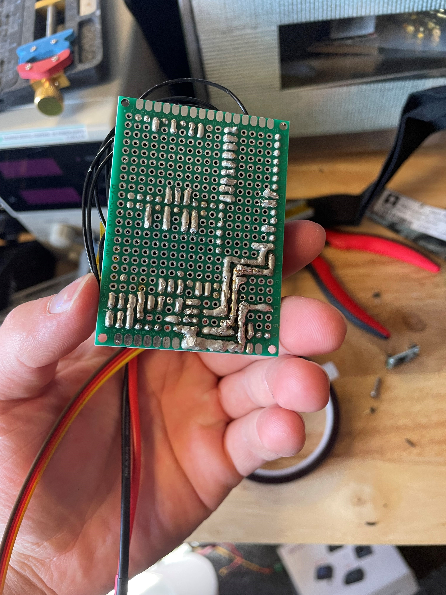

After constructing the prototype and showing it to the team, a lot of feedback was received which informed the rest of the design as well as the continually evolving PCB design.

## EE Production

Once the prototype was made, focus was on producing the PCB version of the design.

Most PCBs of the complexity that we were working with are 4-layer, meaning that they have 4 internal layers that you can route traces on. However, to save cost, I spent a lot of design time making the PCB 2-layer instead of 4. This led to some really beautiful trace routing to make the most of the available space.

Also, I performed simulations in LTSpice (not shown) to get some experimental data for design decisions like a reverse polarity protection circuit.

After all was said and done, here are renderings from our vendor:

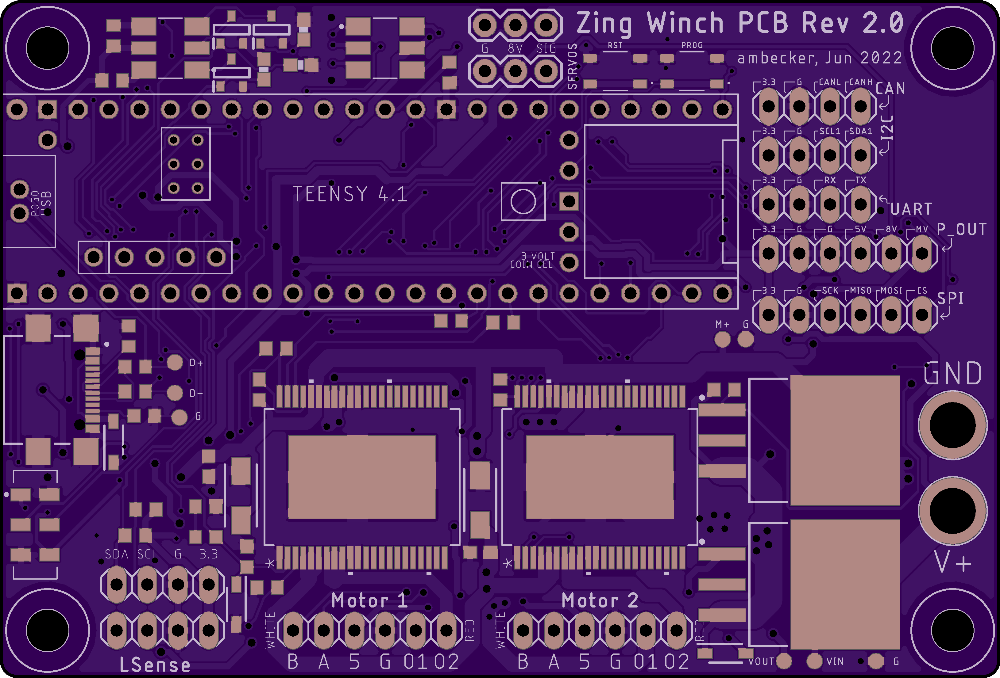
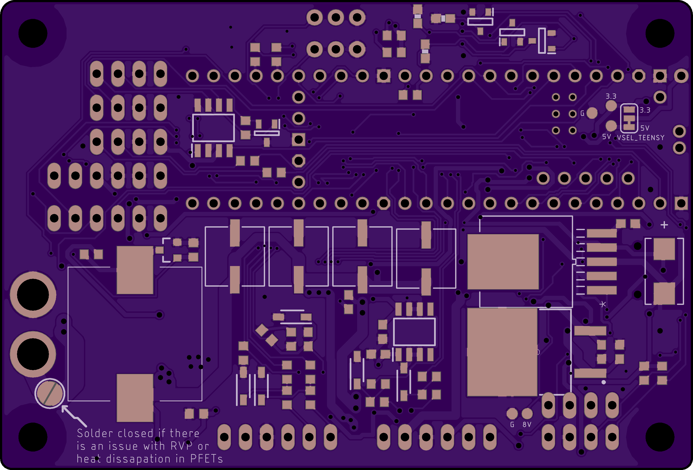

Then, it was just a matter of spending many hours assembling, testing, and debugging the full system.

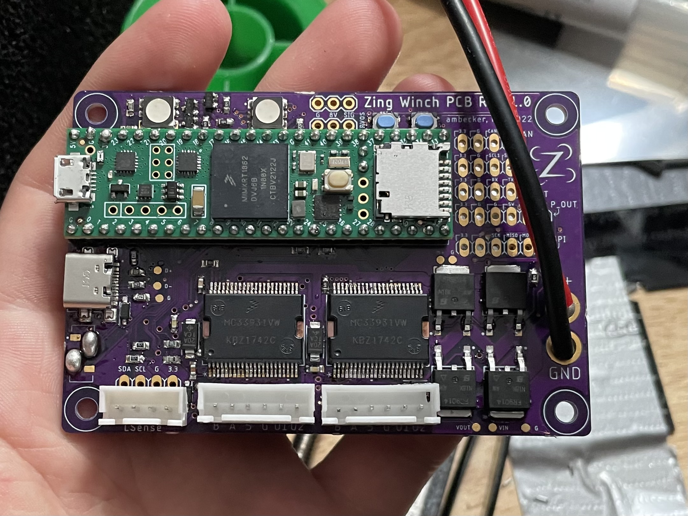
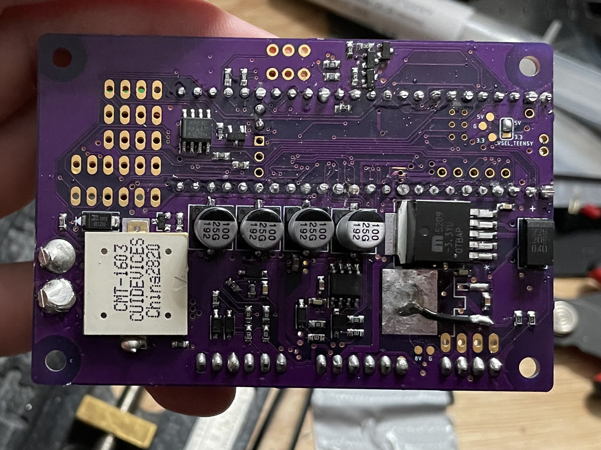

Finally, I had an "oh my god it works!" moment when I connected it to a motor for the very first time and saw it running (at 5am, no less):

## CAD and Production

At the same time as the EE production was ongoing, the CAD design was also advancing. I also iterated very quickly here, producing many different slightly tweaked versions of the design.
The CAD was done in Solidworks, along with calculations done by hand and with software (not shown). Take a look at my Formula SAE entry to get an idea of what hand calcs entail, but essentially I came up with specifications for the product (such as motor torque), as well as making order-of-magnitude estimates for important operating details such as bending on the main plate while under maximum load.
Taking all of this into consideration, here was the final design:

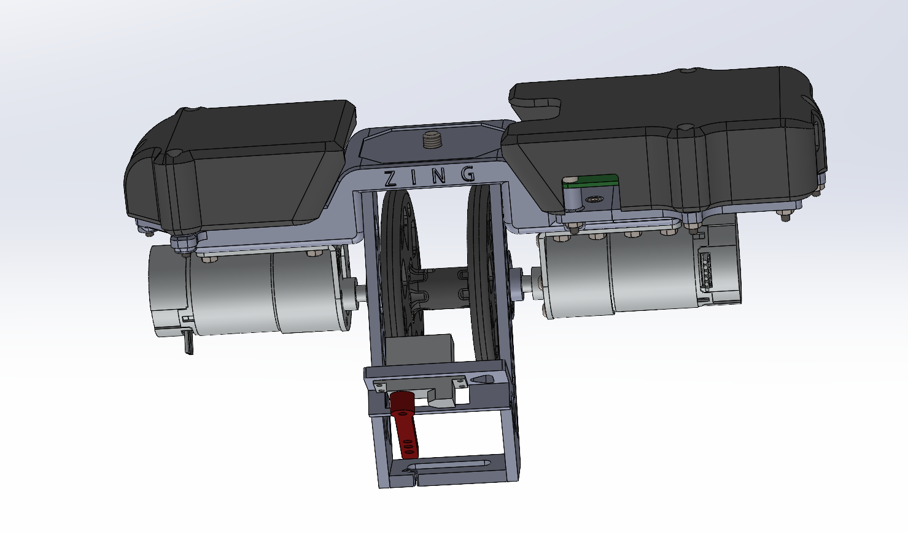

## Software

The software was written in C++, and turned out to be far more complex than I initially thought. The reason for this, was that the motors would sometimes overheat when carrying particularly heavy packages. So I ended up having to characterize the motor, as well as make use of onboard current and RPM sensors, to estimate the internal winding temperature and limit it to a safe range.

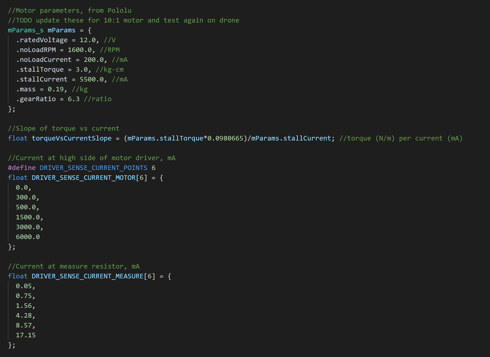

The thermal model used was quite simple, and worked in several discrete steps:
- Calculate electrical energy going into motor from current and voltage sensor
- Calculate mechanical energy out of motor into pulley from RPM sensor and torque curve from voltage characterization
- Assume difference in electrical-mechanical was heat, and assume that the heat was applied to an estimated mass of copper that radiated heat via Newton's Law of Cooling (time constant tau also measured experimentally)

This system worked quite well in preventing any overheating and ensured that the winch was always safe to operate, even in hot temperatures.

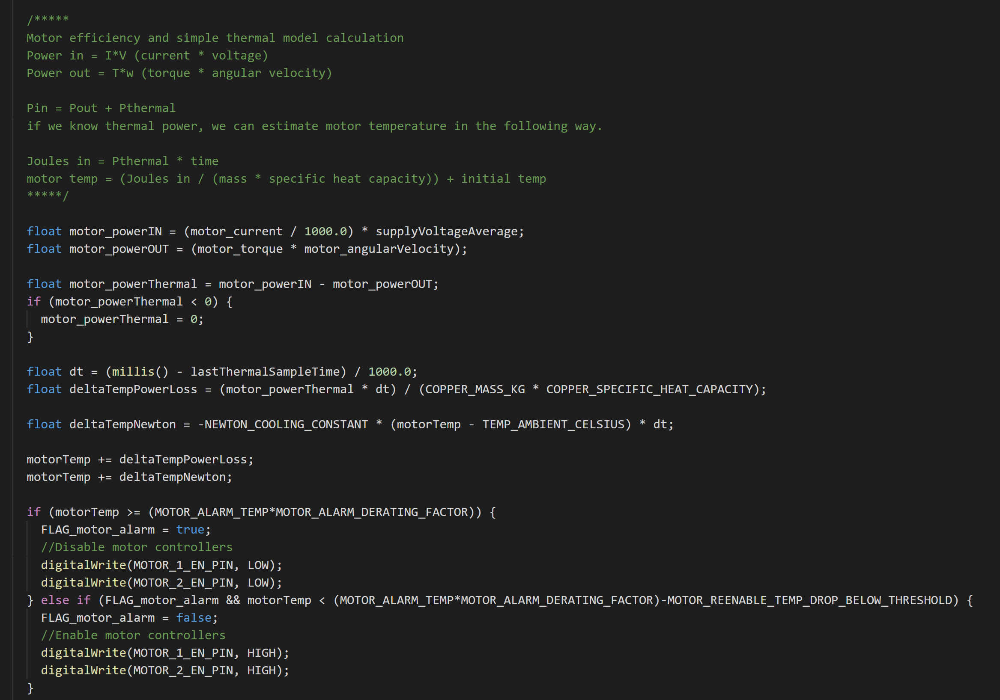

I also employed a simple asynchronous multitasking loop to manage many different features such as driving the motors, toggling the lights, and checking battery voltage, to name a few.

# Conclusion

Overall, this project was a great learning experience for taking a product from the beginnings of an idea to a product that can perform under many different conditions. I definitely got a chance to practice many different kinds of engineering for this project, including PCB Design, Mechanical design and software integration throughout the whole process.