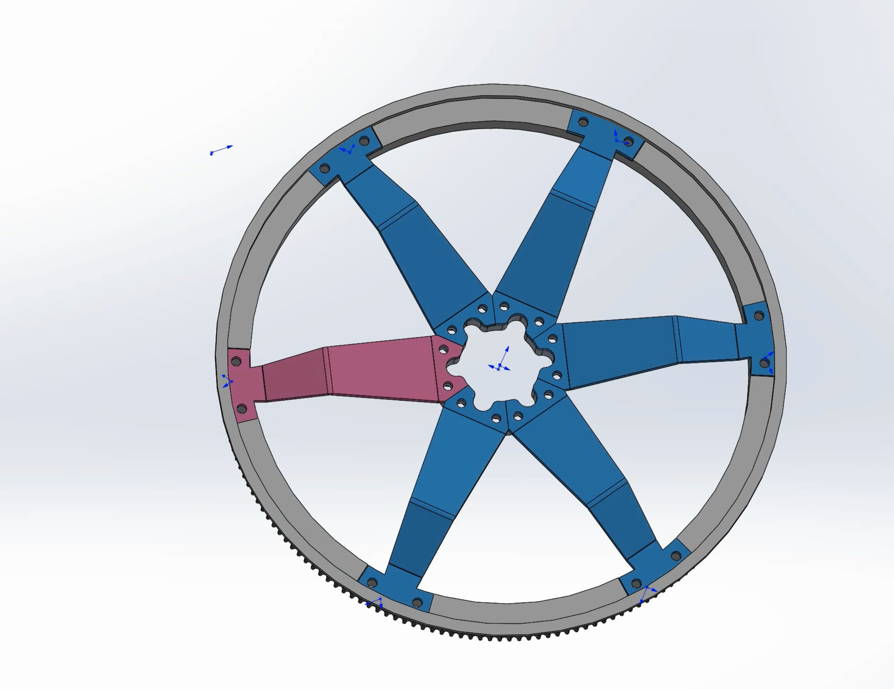
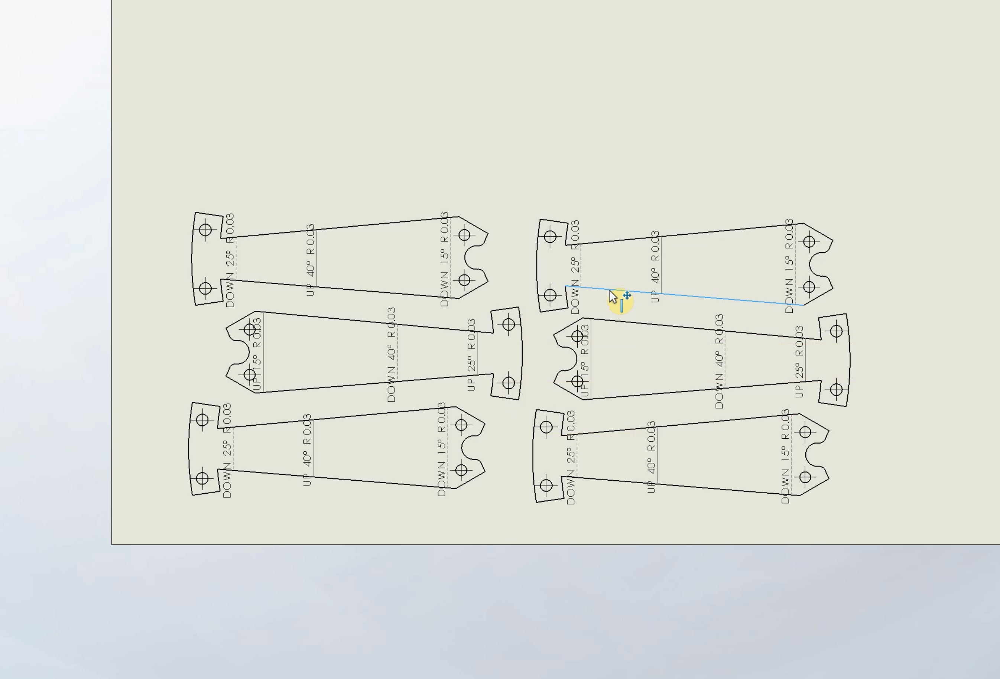
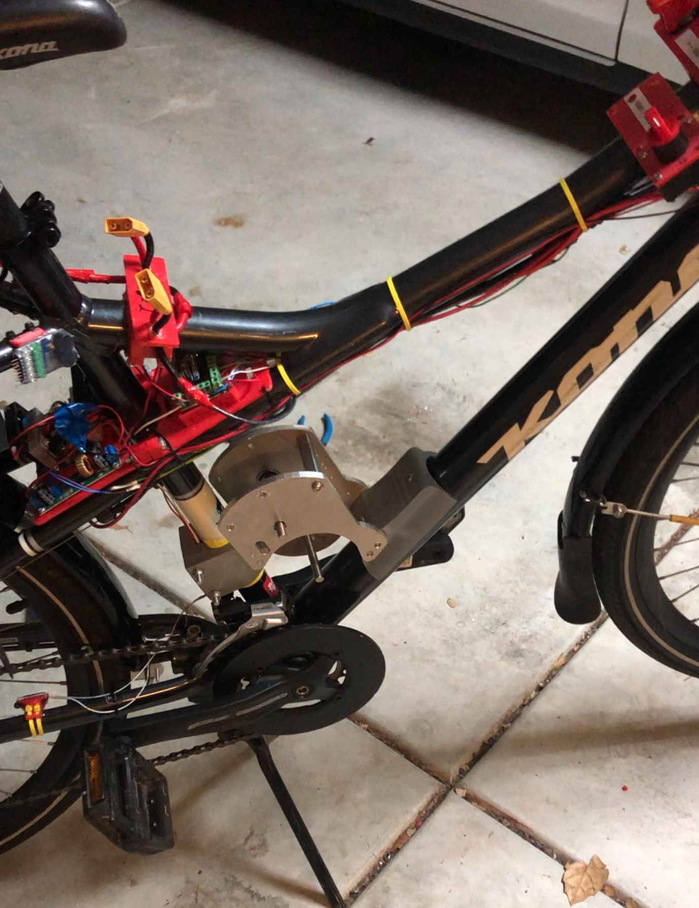
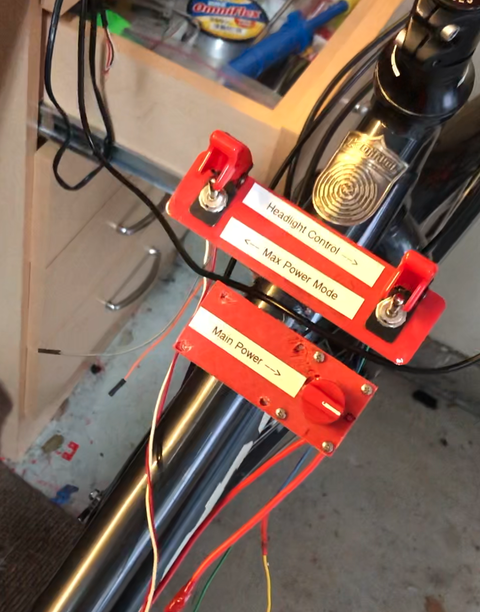

In the summer of my sophomore year of high school, I decided to build a drop-center electric bicycle powertrain from scratch.

Here was the final product:

## Project Background

One of the easiest ways to build an electric bike is with a hub motor, where the rear wheel is powered by a motor built into the hub, where the back casette is attached. This design, however, has some drawbacks, namely the fact that you're limited by the small space available in the rear of the bike, which limits power output.

To account for these shortcomings, I decided to go with a drop-center powertrain instead, where the motor is attached in the place where a water bottle holder normally goes. This let me cram a massive 180cc gas engine equivalent motor into the design - with 4-6kW peak power draw!
This design was also inspired by research I did on YouTube, including the excellent [EBike V4 by Tom Stanton](https://www.youtube.com/watch?v=1pm1RtCuE3A).

Below is a picture of the final rear powertrain:

## CAD

Keeping the rear powertrain in mind, I came up with an architecture for the bike after buying a used cargo bike off of Ebay.
I would need the following:
- Central motor attached to the frame, with appropriate reduction to adjust for motor kV rating
- System of belts to transfer energy into rear wheel of bike
- Custom rear bike pulley to mesh with belts

Over the next few months, with this design in mind I began modelling the pieces in CAD, using Solidworks/Solidworks simulation for FEA.

In-progress photos:

My final assembly for the wheel CAD, including a mockup of the bike wheel (visible is the large rear pulley):

Once the CAD for all the parts was finished, I moved to making some simple drawings so that I could keep track of the parts I would need.

Once I was able to print the drawings, I then moved into CAM (MeshCAM, later would use Fusion 360 CAM/HSMWorks).

## Machining and Assembly

Finally, I machined out all the parts I would need on my school's TechnoCNC machine, including the center plate:

Assembly went fairly well, starting with the rear wheel hub parts:

Then I drilled out the rear powertrain:

The massive 180T rear pulley I made several attempts at printing myself (in 4 different sections, combined with locating features), before giving up and outsourcing it to Shapeways. Their machines were able to produce it in a single part while taking only about 10 days for the reasonable cost of $70. The final wheel / powertrain at the beginning of assembly:

I then mounted the rear wheel onto the bike:

And then finished up the center powertrain mounting to the frame tubes:

## Electronics/Software

The electronics were fairly simple, with an Arduino Nano taking the controls from a twist throttle attached to the handlebar. The Arduino compared the desired speed from the handlebar (using a simple linear mapping) to the actual speed calculated by the rotation of the rear wheel passing by a hall effect sensor. Using a PID (proportional, integral, derivative) control system with hand-tuned gains, this gave a simple closed loop feedback system to maintain control over the bike at all times.

This system also allowed me to implement a simple cruise control mode that would ensure the speed stayed constant without having to hold the handlebar for longer rides.

All of these controls were augmented with a simple directional joystick onboard that let me toggle through the menus easily.

Finally, I took advantage of both hardware interrupts (for the rear wheel hall effect sensor, to get the most accurate timing) and sif

The full code can be seen [here](https://github.com/aaroexxt/BikeOSMKII/blob/master/bikeOS/bikeOS.ino).

### Funny Side Note

California laws limit both the maximum power and speed of an EBike to 28MPH/700W under Class 3. To be compliant, the software limited the power and maximum speed to these values at all times so that I could use it on public roads lawfully. However, I included a switch labeled "Illegal Mode" (later renamed to "Max Power Mode") onboard, which would disable these limits and enable the full power/speed range of 35MPH/4500W, for use on private property only.

## Software

All the software ran on a small COTS Arduino Nano board mounted to a custom board made out of some Adafruit permaboard (essentially solderable breadbaord).

I also wrote a custom library to display large characters on the screen, on a 20x4 I2C LCD panel. It really looked pretty cool when powering up:

## Putting it All Together

Once assembled over the course of several months, I finished putting everything together. This started with just a drivetrain powerup:

Once I had signs of life, I attached the pulley system along with a simple 3D printed tensioner, and was able to get a full wheel spin allowing me to ride the bike!

