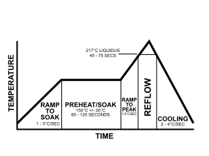
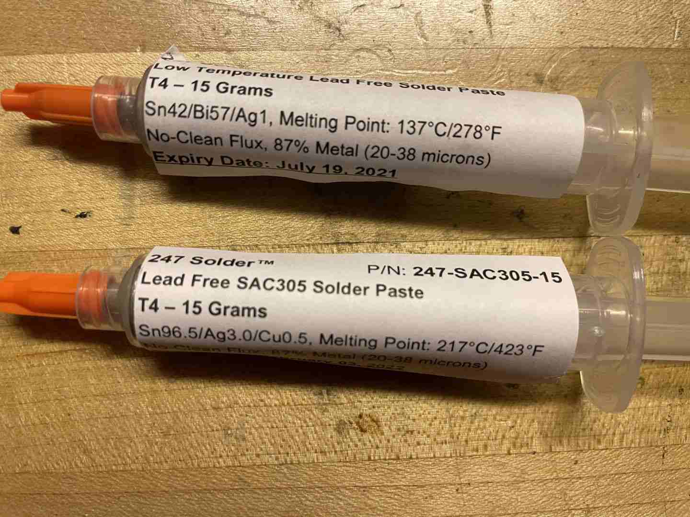
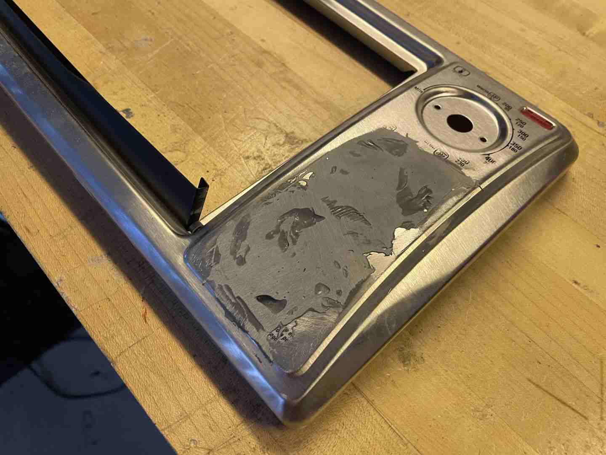
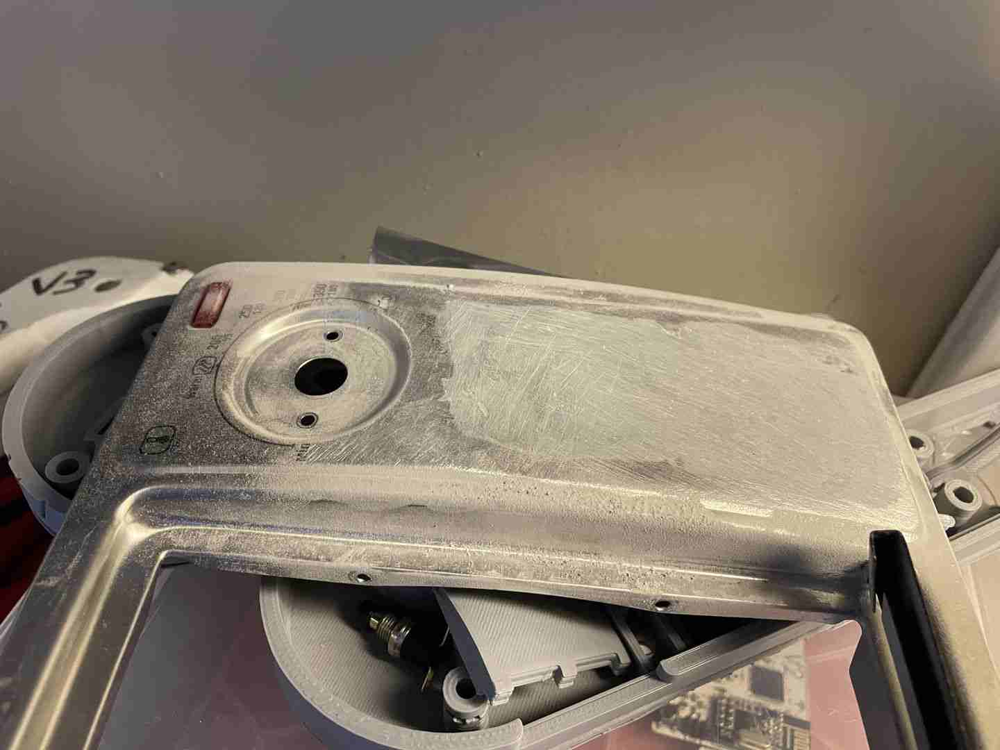
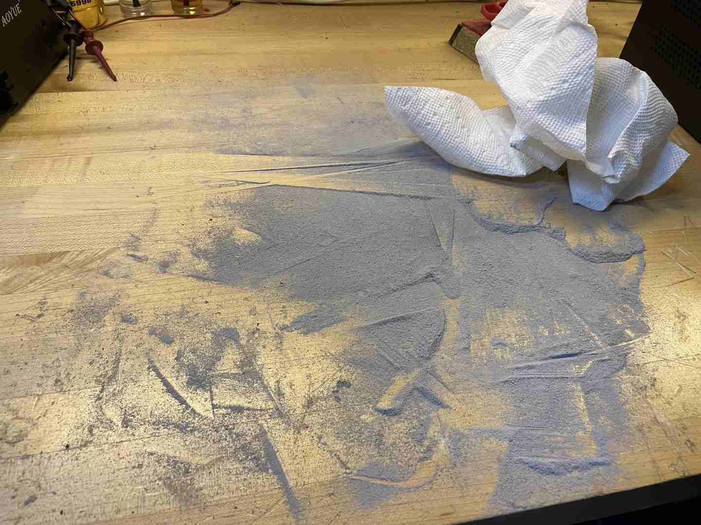
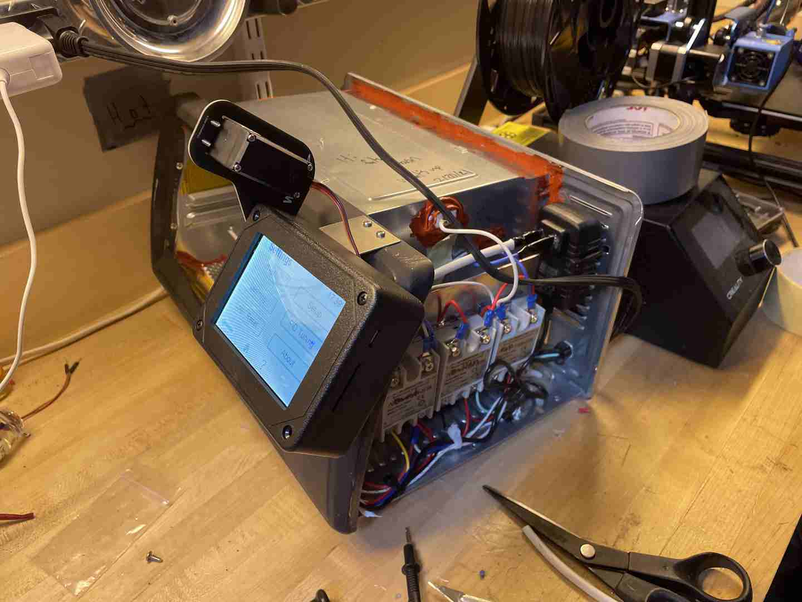
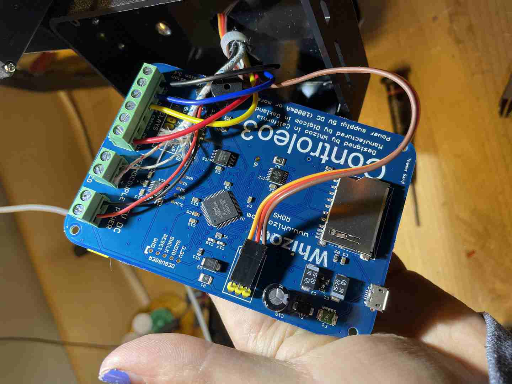
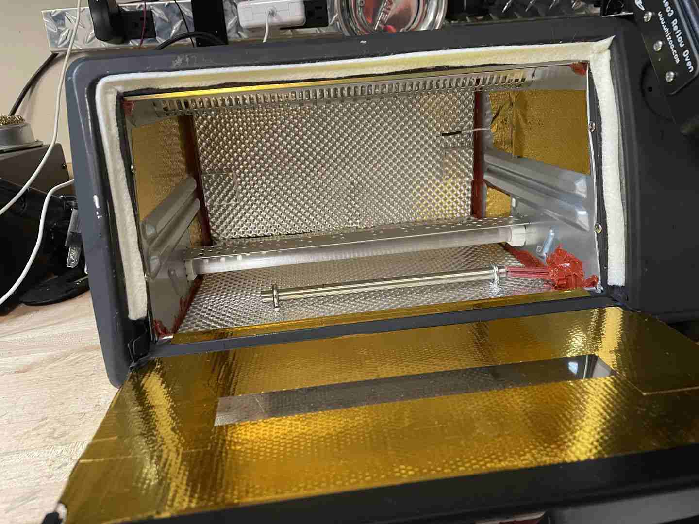
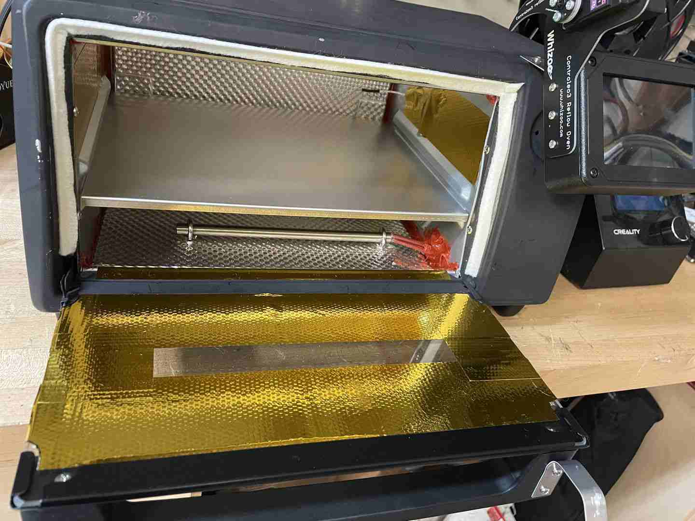

During the winter of 2020, I build a homemade reflow oven based on Controleo3 to allow me to reflow my PCBs more accurately and quickly.

## Background

The main issue with commercial ovens is that they leak heat very quickly out of their back and sides, due to a flimsy and cheap thin metal design. That, combined with the imprecise temperature control, meant that it's very difficult to hold the careful temperatures required for proper reflow following a profile.

## The Build

I started with a standard 30$ toaster oven that I bought off of EBay that I wanted to modify. After firing it up and testing it, I started with an immediate dissassembly.

I was eventually left with two major sections, the outer casing and the inner part with the heating elements.

The front panel had some extra button holes that needed to be filled with some thermal-resistant epoxy, which I added:

But the cavities weren't suitable for painting, so I shaved it down (entirely by hand) with sandpaper, which took an hour or so before I got the look I wanted.

While the epoxy was curing, I added a different type of thermal epoxy to the seams of the original oven casing, which helped seal them when heated:

Once everything was dry, I gave it a coat of paint:

Once reassembled in the original housing, I added another heating element and wired up the original 2 plus the additional one to some Solid State Relays (SSRs) to allow me to control their temperature (@110V) with logic-level board signals from a Controleo3.

Then, I added a thermal blanket for insulation before reattaching the top:

Finally, I added internal insulation (silver colored) and reflective tape (gold colored) to help trap even more heat, then installed the PCB tray:

## Conclusion

This oven has let me make PCBs that were more complex than anything I could have done by hand before I had it, and has seriously boosted my building capacity. I'm proud of how well it turned out!

Boards made with the oven:

