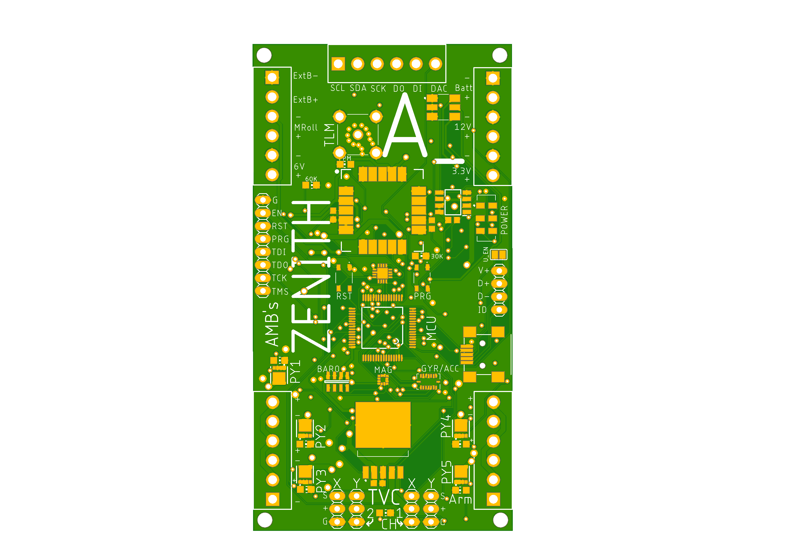
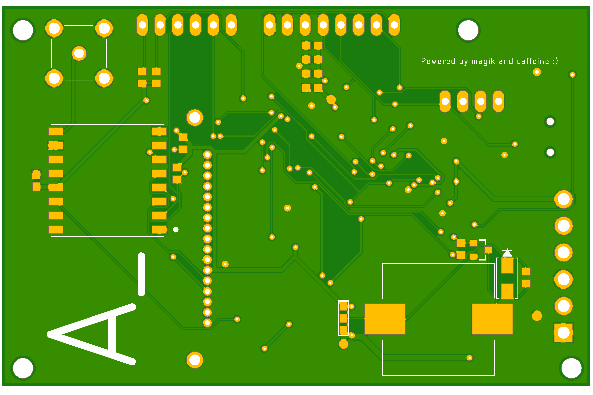

## About TVCRocket

In Fall 2021, I developed an ARM M0-based flight computer that I codenamed Zenith.
It was purpose-built was to do real-time control of thrust vectored model rockets. Onboard, there are a number of sensors sensors, including a 9dof IMU and GPS for localization, packet radio for telemetry, flash and SD card for data logging. Throughout the entire project, I had to carefully optimize my component Bill of Materials and board layout for ease of use and assembly. I also put myself on an extremely strict deadline, only 6 weeks for everything from planning launch sites to putting together 3 rockets.

**Bottom: Flight Computer, Top: Ground Station (868MHz telemetry antennas left)**

**Rockets Before Launch**

**Rocket at launch site in tuning setup**

## PCB Renderings

**Zenith Top**

**Zenith Bottom**

**Ground Station Top**

**Ground Station Bottom**

