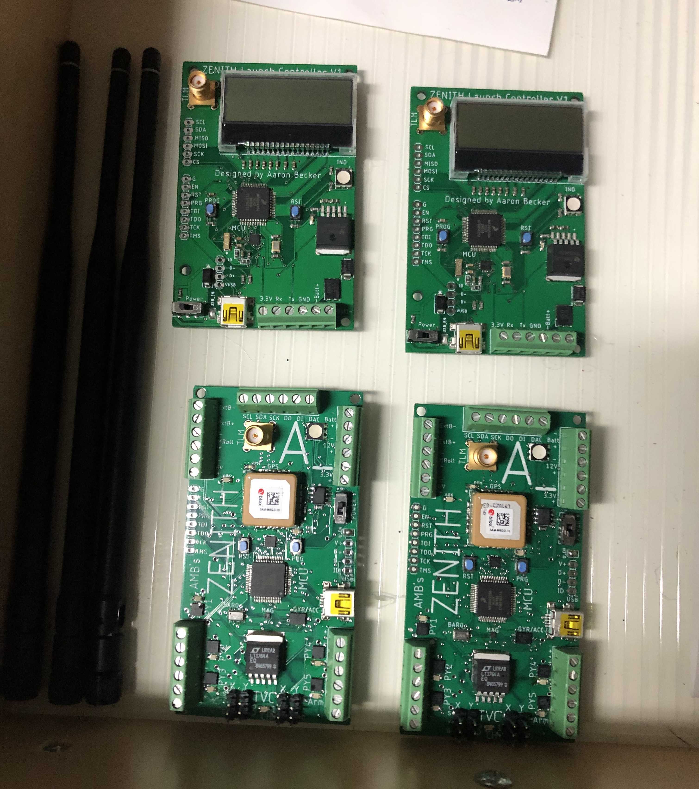
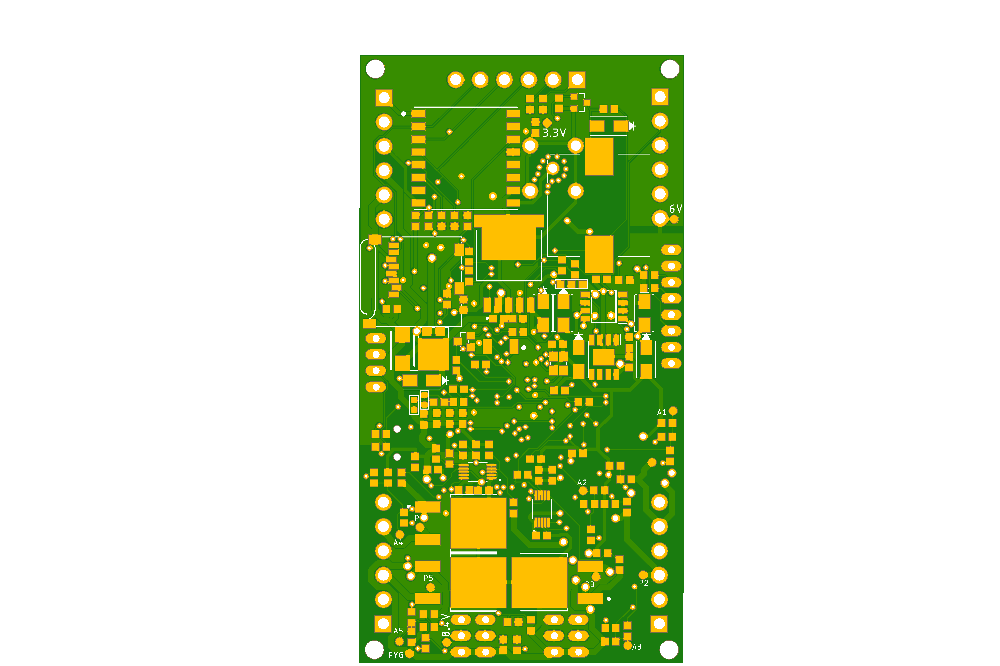

In Fall 2021 to the Spring of 2022, I developed an ARM M0-based flight computer that I codenamed Zenith.
It was purpose-built was to do real-time control of thrust vectored model rockets. Onboard, there are a number of sensors, including a 9dof IMU and GPS for localization, packet radio for telemetry, flash and SD card for data logging. Throughout the entire project, I had to carefully optimize my bill of materials and board layout for ease of use and assembly. I also put myself on an extremely strict deadline, only 6 weeks for everything from planning launch sites to putting together 3 rockets.
(Click to zoom on any image)

**Bottom: Flight Computer, Top: Ground Station (868MHz telemetry antennas left)**

As I was putting the boards together, I also assembled 3 complete TVC-capable rockets before launch in my garage (pictured in background, TIG welder and electric bike!)
They included a thrust-vectoring mount capable of swivelling the solid rocket motor several degrees in any axis to adjust the trajectory of the vehicle on the fly.

**Rockets Before Launch**

I also tested the rockets before I left using a custom 3D printed fitting for the TVC mount which let me add a known amount of thrust using commercial drone propellers. Here you can see a test on the X and Z axes (in body frame, 0-10deg) in which the mount is gimballed.

When I got to the launch site, I used a custom 3D printed gimbal to tune the PID loops controlling the throttle, which were attached at the rocket's center of mass (exactly where the rocket was also pivoting around in flight) and adjusted the parameters until it was able to stabilize itself.

**Rocket at launch site in tuning setup**

The TVC mount was further refined using this gimbal setup which let me run the entire control feedback system in real time.

## PCB Renderings

Before the boards were assembled, I also rendered out views of the board from my PCB design program of choice, EAGLE, before assembling them by hand.
Note that both of these boards are 4-layer, 1oz copper thickness, and 4mil minimum trace width.
(Click to zoom on any image)

**Zenith Top**

**Zenith Bottom**

The ground station was given a similar treatment before it was also assembled:

**Ground Station Top**

**Ground Station Bottom**

